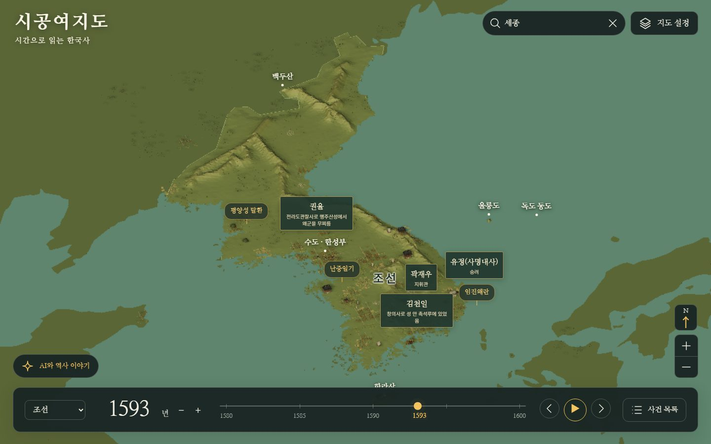
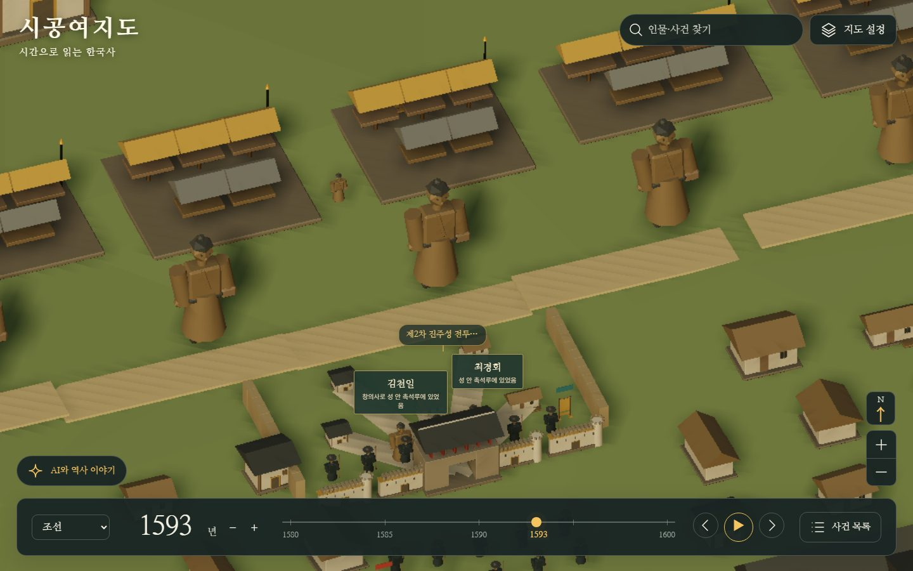
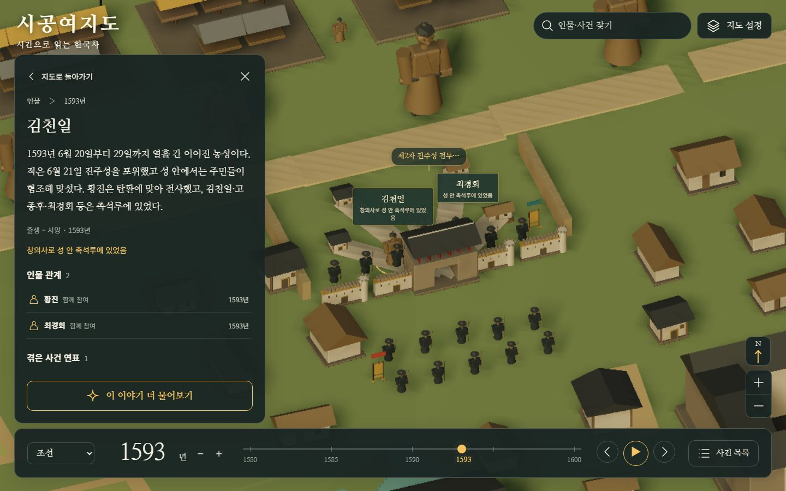
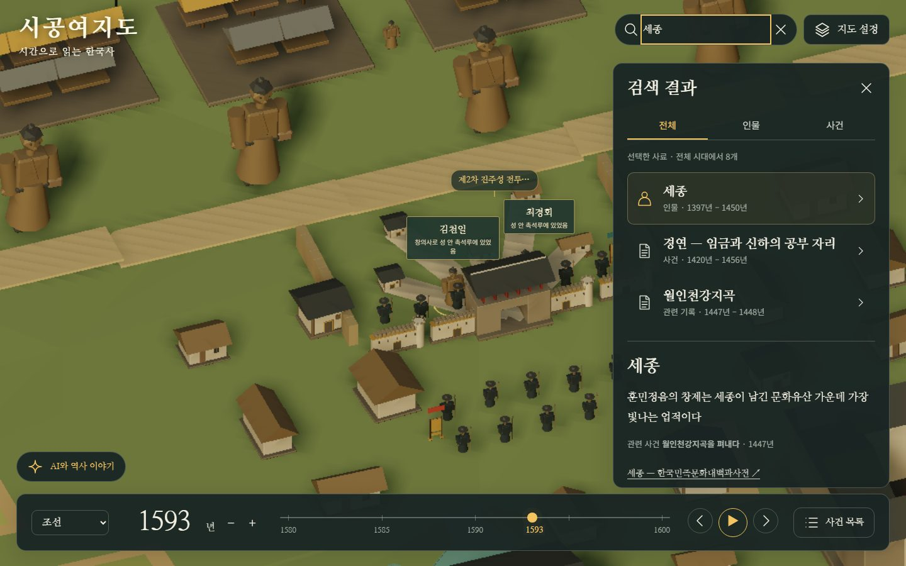
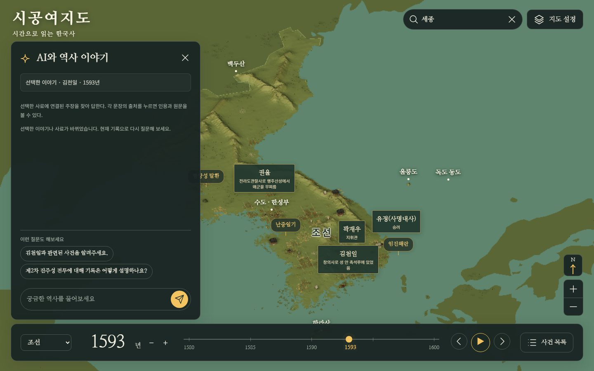

<div align="center">

<a href="https://sigong.rabbion.info/"></a>

# 시공여지도

**연도를 끌면 그 해의 한국사가 지도 위에 펼쳐져요. 모든 이야기에는 어느 기록이 그렇게 말했는지가 붙어 있어요.**

SIGONG YEOJIDO · A Spacetime Atlas of Korean History

[**지도 열기**](https://sigong.rabbion.info/) · [사용법](#이렇게-써요) · [무엇을 볼 수 있나](#무엇을-볼-수-있나) · [자료 출처](#바탕이-된-기록) · [직접 실행](#내-컴퓨터에서-실행하기)

</div>

---

김정호는 1861년에 자기 시대의 조선을 목판에 새겼어요. 대동여지도는 한 시점의 공간이에요.
시공여지도는 거기에 시간을 얹어요. 고조선부터 현대까지 연도를 옮기면 그때의 나라 경계와 사람, 사건이 3D 지도 위에서 바뀌고, 화면의 모든 이름표는 삼국사기나 조선왕조실록 같은 원 기록으로 이어져요.

## 무엇을 볼 수 있나

<p align="center">
<a href="https://sigong.rabbion.info/"></a>
</p>

위 화면은 1593년, 임진왜란 한가운데예요. 조선의 영역과 수도 한성부가 보이고, 그 해에 살았던 권율과 곽재우, 그 해에 벌어진 평양성 탈환이 실제 장소 위에 이름표로 떠 있어요. 연도를 바꾸면 이 모든 것이 그 해의 것으로 바뀌어요.

<p align="center">


</p>

**가까이 가면 마을이 보여요.** 확대하면 그 시대의 집과 길, 성곽이 나타나고 사람들이 오가요. 기록에 있는 장소는 진하게 그려요. 기록이 없어 추정으로 채운 배경은 흐리게요.

**이름표를 누르면 이야기가 열려요.** 왼쪽 패널에 설명과 살았던 기간, 함께한 사람과 겪은 사건 연표를 정리해서 보여줘요. 문장마다 출처가 있어서 어느 기록에서 온 말인지 바로 확인돼요.

<p align="center">


</p>

**검색.** 이름을 넣으면 인물과 사건, 관련 기록으로 나눠 보여 주고 하나를 고르면 그 연도와 장소로 지도가 이동해요.

**AI와 역사 이야기.** 보고 있는 이야기와 연결된 기록 안에서만 답하는 대화창이에요. 답변의 각 문장을 누르면 인용과 원문이 열려요. 기록에 없는 것은 없다고 말해요.

**설화와 전승은 따로 봐요.** 처용이나 아랑 전설처럼 역사 사건과 갈래가 다른 이야기는 별도 목록에서 한 편씩 무대와 함께 봐요.

## 이렇게 써요

1. **들어가기.** [sigong.rabbion.info](https://sigong.rabbion.info/)를 열고 기기에 맞는 화질을 고른 뒤 들어가기를 눌러요. 패드나 오래된 기기는 낮음이 빨라요.
2. **시간을 옮기기.** 아래 막대를 좌우로 끌거나, 연도를 직접 입력하거나, 시대 메뉴에서 고려·조선처럼 시대를 골라요. 재생 버튼을 누르면 시간이 흘러가고 양옆 화살표는 사건이 있는 연도로 건너뛰어요. 기원전은 −500처럼 입력해요.
3. **지도 둘러보기.** 끌어서 이동하고, 휠로 확대하고, 오른쪽 버튼을 누른 채 끌면 회전해요. 지도 설정에서 시야를 이 시대 가까이, 한반도 전체, 주변국까지 셋 중 하나로 바꿔요.
4. **이야기 읽기.** 지도의 이름표나 사건 목록에서 하나를 누르면 왼쪽에 이야기 패널이 열려요. 출처를 누르면 인용된 원문이 나와요.
5. **더 알아보기.** 위쪽 검색창에서 인물이나 사건을 찾거나, 이야기 패널의 "이 이야기 더 물어보기"로 AI에게 질문해요.

지도 설정에서는 수도와 산, 인물과 사건 이름표, 국가 영역, 마을 같은 배경을 하나씩 켜고 꺼요. 북위 38도선을 표시하거나 AI 기능을 아예 끄는 것, 시간 막대 범위와 화질도 여기서 바꿔요.

## 믿을 수 있는 이유와 한계

- **기록 없이는 말하지 않아요.** 화면의 설명과 AI의 답변에는 수록된 기록에서 뽑은 인용이 붙어 있어요. 근거가 없으면 "기록이 없다"고 말해요.
- **어긋나는 기록은 나란히 둬요.** 기록끼리 다르게 말하면 어느 쪽이 맞는지 정하지 않고 둘 다 보여 줘요. 지도 위의 점이 유적의 좌표인지, 오늘날의 대표 지점인지도 위치 안내에 적어요.
- **추정은 추정이라고 써요.** 기록이 없는 마을, 밭, 동물은 "추정 배경 · 사료 없음"으로 표시하고 흐리게 그려요. AI가 그린 상상도에는 "AI 생성 상상도" 표시가 붙어요.
- **한계도 있어요.** 나라 경계선은 연구자들이 재구성한 자료(HGIS, Cliopatria)를 옮겨 그린 선이라 당시의 확정된 국경은 아니에요. 기록에서 뽑은 설명은 AI가 초안을 만들고 기계 검사를 거쳤지만 사람이 전부 검토했다는 기록은 아직 없어요. 논문이나 수업 자료에 쓰기 전에는 출처를 눌러 원문과 대조해 주세요.

## 바탕이 된 기록

옛 기록의 원문은 국사편찬위원회가 공공데이터포털에 공개한 자료를 그대로 넣었어요.

- 삼국사기, 삼국유사, 고려사, 고려사절요
- 조선왕조실록 전체, 승정원일기, 비변사등록, 고종·순종실록
- 광개토왕릉비와 한국고대금석문, 한국고대사료집성, 한국독립운동사자료
- 인물과 사건 설명의 짧은 인용은 한국민족문화대백과사전에서 가져왔고 원 페이지로 링크를 걸어 뒀어요
- 나라 경계와 옛 행정구역은 HGIS와 Cliopatria, 해안선과 지형은 Natural Earth와 ETOPO 2022를 사용해요
- 시작 화면의 지도는 규장각 소장 대동여지도(퍼블릭 도메인)예요

자료별 입수처와 이용 조건, 확인한 날짜는 [사료 목록](docs/01-sources.md)에 있어요.

## 내 컴퓨터에서 실행하기

Python 3.11 이상이면 별도 설치 없이 뷰어가 떠요.

```bash
git clone https://github.com/Youkamii/sigong-yeojido.git
cd sigong-yeojido
python3 services/host/server.py --port 8870
```

브라우저에서 `http://127.0.0.1:8870` 을 열어요. 시작할 때 색인을 만드느라 잠시 기다려야 해요.
저장소에는 사료 카드와 인용된 원문이 들어 있고 실록과 승정원일기 전체 원문 같은 큰 파일은 따로 만들어야 해요. 전체 자료 준비, 그래프 검색(Fuseki), AI 대화 설정, 사료 추가 방법은 [개발·운영 안내](docs/DEVELOPMENT.md)에 있어요.

## 더 알아보기

- [왜 이렇게 만드나](docs/00-vision.md): 기록을 사실이 아니라 "누가 그렇게 말했나"로 다루는 이유
- [사료 목록](docs/01-sources.md) · [데이터 구조](docs/02-schema.md) · [개발·운영 안내](docs/DEVELOPMENT.md)
- 오류나 제안은 [GitHub 이슈](https://github.com/Youkamii/sigong-yeojido/issues)로 알려 주세요

옛 기록의 한문 원문은 저작권이 소멸한 자료이고, 그 밖의 자료는 각 출처의 이용 조건을 따라요. 코드의 라이선스는 아직 정해지지 않았어요.
