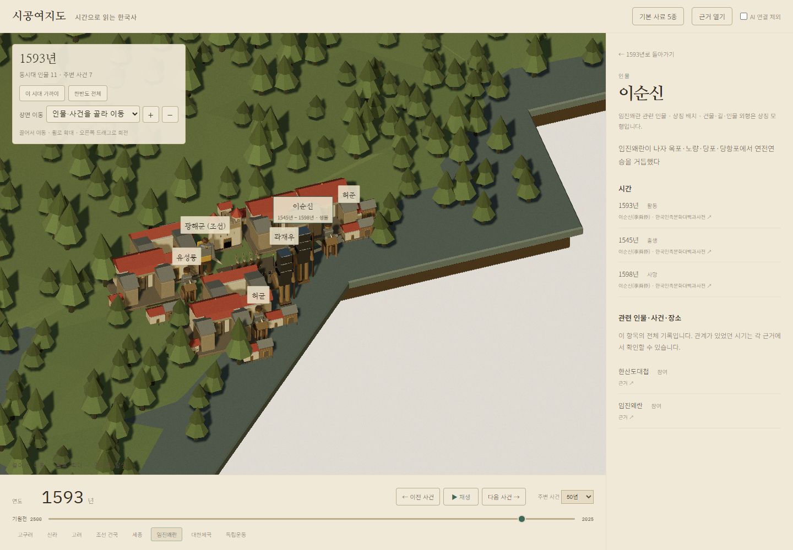

# 왜 현재 3D 역사 화면이 요구를 놓쳤는가

2026-09-08 · [검토 #100](https://github.com/Youkamii/sigong-yeojido/issues/100) · 검토 기준 main `f39f49d1bfa5c9e31c0024f629b85f91c8d3eb16`

**원인은 ‘그때 누가 어디에서 무엇을 했는가’를 제품의 기본 단위로 삼지 않은 것이다.** 생몰·재위가 있는 사람을 고르고, 사건 관계를 붙이고, 빈 위치는 임의의 땅으로 채웠다. 그 뒤 사람 수·모형 수·클릭 동작을 검사했다. 이렇게 하면 자료가 늘고 검사가 통과해도 역사 장면은 틀리거나 의미가 없어진다. 조사 지시와 완료 기준을 정한 총괄·구현의 문제다.

사용자 요청대로 `gpt-6-astra`, `xhigh` 3개가 역사 정합성, 3D 디자인, 제품 방향을 각각 독립 검토했다. 이 문서는 그 결과를 대조한 실행안이다. **리뷰는 완료했고, 아래 제품 수정은 아직 완료하지 않았다.** 새 역사 조사·수집은 이번 리뷰에서 실행하지 않았다.

- [역사 정합성 원문](review-100/history.md)
- [3D 장면·탐색 디자인 원문](review-100/design.md)
- [제품 방향·조사·검사 원문](review-100/product.md)
- [공개판 배치 기록](review-100/live-placement.json) · [이순신 선택 화면](review-100/yi-sunsin-live.png)
- [조사 지시 발췌](review-100/research-instructions.json) · [수집 결과 집계](review-100/research-counts.json) · [검토 범위](review-100/context.json)

## 1. 이순신이 왜 거기에 있는가: 공개판에서 확인한 원인

1593년 공개판에서 이순신은 다음 자료를 통해 나타난다.

1. 생몰 1545–1598 → 1593년에 살아 있는 사람으로 포함.
2. 1593년 삼도수군통제사 임명 기록 → 그해 활동은 있지만 장소 연결 없음.
3. 1592–1598년 임진왜란 참여 관계 → 장기간의 전쟁에 관련된 사람으로 연결.
4. 임진왜란의 장소 근거 없음 → ID로 만든 임의의 육지 위치 사용.
5. 이순신을 그 전쟁 위치 주변으로 배치 → 실제 장소처럼 보이는 사람·건물 장면 생성.

실측 값은 `placement=relation`, `site=null`, `locationReference=null`이며 설명은 `1545년 – 1598년 · 생몰`이다. 경도·위도는 `[127.70882763376632, 34.730404888337084]`지만 **그 숫자를 뒷받침하는 이순신의 활동 장소 근거는 없다.** 사용자가 본 ‘정중앙’ 구도를 그대로 재현했다는 뜻은 아니다. 현재 공개판에서도 근거 없는 전쟁 위치를 인물에게 전달하는 오류를 확인했다는 뜻이다.

같은 화면의 인물·사건 14행은 `site 1 / related-place 4 / relation 2 / symbolic 7`이었다. 이는 배치 경로의 분포이며, `site` 이외는 전부 거짓이거나 `site`이면 역사 검증 완료라는 집계가 아니다. 각 경로가 선택 시점·현장 활동·위치 근거를 확인하는지 별도로 검사해야 한다.

## 2. 실패가 이어진 여섯 단계

| 단계 | 확인한 문제 | 사용자가 겪는 결과 |
|---|---|---|
| 요구 해석 | ‘시간별 사람·사건·장소’를 생존 인원·자료량으로 바꿈 | 사람이 늘어도 그때의 역사를 설명하지 못함 |
| 조사 지시 | 생몰·재위·빈 연도를 우선하고 새 좌표는 불필요하다고 지시 | 연표는 늘지만 활동과 장소의 연결이 비어 있음 |
| 자료 연결 | 전쟁 참여, 구상 참여, 관련 인물을 특정 현장의 사람으로 취급 | 그해 그곳에 있었다는 근거 없이 배치됨 |
| 공간 구성 | 인물마다 집, 사건은 전투/족자, 숲은 비슷한 밀도 | 어디나 비슷한 작은 조형 묶음이며 행동 차이가 없음 |
| 시간·탐색 | 생몰과 평생 직함을 우선하고 전체·지역·사건의 표현이 비슷함 | 연도 숫자와 이름표는 바뀌지만 무엇이 달라졌는지 모름 |
| 검사 | 인원·육지 안·표면 높이·클릭·생몰 인용을 검사 | 역사적으로 잘못된 위치도 PASS 가능 |

실제 Opus 5 / Max 조사 기록은 있다. 검토한 7개 작업의 948개 주장은 생몰·재위 344개, 활동 53개, 사건 참여 122개, 사건 장소 37개를 포함하지만 인물의 `physicallyPresentAt`은 0개다. 뒤의 gap_years 32개는 이 집계에서 제외했다. 이 수치만으로 모든 자료가 무용하다고 판단하지 않는다. **조사 목표가 사용자의 위치·활동 질문을 답하도록 설계되지 않았다는 증거**다.

별도 공개 브라우저 검사는 root가 수행했다. 역사·제품 리뷰어는 코드와 저장 자료를, 디자인 리뷰어는 제공 화면·새 실측 파일·Fantology 코드를 검토했다. 코드상 환산 출처·불확실한 기간 처리 위험도 발견했지만, 해당 위험이 실제 공개 자료에서 잘못된 환산을 만든 사례까지 확인한 것은 아니다. 기존 검사 통과와 새 수정의 수용 여부를 혼동하지 않는다.

## 3. 만들 제품: 큰 한반도 안에 ‘그 시기의 장소와 활동’이 보이는 세계

한반도의 큰 공간은 유지한다. 장소마다 취락·포구·성·물·들·숲이 함께 구성되고, 선택 시기의 사건과 역할이 그 안에 나타나야 한다. **인물 한 명에 집 하나를 붙이는 규칙을 장소 하나에 활동을 구성하는 규칙으로 바꾼다.**

Fantology 레퍼런스에서 가져올 것은 나무 모양만이 아니다. 큰 지형, 중간 크기의 취락과 물, 작은 사람과 나무 사이의 크기 차이, 숲 군락과 여백, 장소의 중심이 보이는 구성을 가져온다. 한반도를 작은 원판으로 줄이거나, 공중섬·빛기둥·판타지 성을 복제할 이유는 없다.

| 대안 | 얻는 것 | 실패 가능성 | 결정 |
|---|---|---|---|
| 모든 기록에 같은 몇 가지 장면 적용 | 빠른 전국 확장 | 서로 다른 시대·활동이 같은 마을처럼 보임 | 보조 표현으로 사용 |
| 주요 지역의 사건 장면 + 전국 공통 표현 | 장소·역할이 읽히며 나머지 기록도 탐색 가능 | 대표 장면만 완성하고 전체를 방치할 수 있음 | **권고안**; 대표 밖 자료 범위도 검사 |
| 전국의 연속 역사 시뮬레이션 | 건물·이동·인구까지 연속 변화 | 근거 없는 움직임과 상태를 대량으로 만들어야 함 | 현재 범위에 넣지 않음 |

### 확대 단계마다 읽히는 내용

- **전체:** 큰 한반도 윤곽, 산줄기·바다·섬, 선택 시기의 주요 사건 지역. 모든 사람 이름을 같은 크기로 펼치지 않는다.
- **지역:** 지금 한반도의 어디인지 지명이 남고, 숲 군락·들·취락·포구가 서로 연결된다. 사건이 장소 안에 자리 잡는다.
- **사건:** 인물과 활동 대상이 보인다. 해전은 물과 배, 간행은 제작물과 작업 공간 등 활동 종류가 구별된다. 근거 없는 진형·옛길·건축 배치를 사실로 복원하지 않는다.
- **인물 선택:** 첫 설명은 ‘선택한 시점에 한 일’이다. 역할 근거와 장소 근거를 바로 열 수 있다. 생몰과 전체 전기는 그 뒤에 둔다.
- **연도 이동:** 장소의 지리적 기준은 안정적으로 유지하고, 확인된 사건·역할·시설의 시기 변화만 반영한다. 자료가 없는 구간은 직전·다음 기록의 날짜와 이동 선택을 제공하되, 그 사이 계속 같은 장소에 있었다고 표현하지 않는다.

장소 안의 모형 간격은 이해를 돕는 화면 구성이다. 개별 인물의 실측 위경도나 당시 건물 배치를 복원한 것처럼 내보내지 않는다. 반대로 단순히 전쟁에 관련됐다는 이유로 그 사람을 한 지역의 현장 인물로 넣을 수도 없다.

## 4. 필요한 자료 연결: 새 거대한 스키마 없이 활동 한 건을 완성한다

기존 Claim·TimeSpan·Location·출처를 재사용한다. 화면에 넘길 최소 단위는 아래와 같다.

| 값 | 필요한 구분 |
|---|---|
| 인물 | 누구인가 |
| 시점 | 언제인가; 계속된 기간인지, 그 범위 중 어느 때인지 |
| 활동 | 어떤 작은 사건에서 무엇을 했는가 |
| 역할 | 그 활동에서 맡은 역할; 평생 직함을 자동 적용하지 않음 |
| 장소 | 근거 있는 지점·지역·해역 또는 미확인 |
| 현장 관계 | 현장 활동 확인 / 사건 관련만 확인 / 위치 미확인 |
| 근거 | 시간·활동·역할·장소 각각을 받치는 주장과 발췌 |

화면은 이 연결을 사용한다. 전체 생애의 문장에서 첫 지명을 찾거나, 관계가 연결됐다는 이유만으로 같은 장소로 보내지 않는다. 지역 수준의 근거도 수용하되 정확한 점으로 바꾸지 않는다. 해상 근거는 물 위에 표현한다. 한 해에 여러 활동이 있으면 날짜·활동을 선택하게 하며, 확인되지 않은 이동 경로를 그리지 않는다.

위치 미확인 인물도 해당 시대 탐색과 기존 상세에서 계속 찾을 수 있어야 한다. 다만 임의의 땅으로 카메라를 보내지 않는다. **이 처리만 한 뒤 사람 대부분을 지도에서 없애는 것은 완료가 아니다.** 주요 인물의 활동·장소 자료를 실제로 연결해 3D 장면에 등장시켜야 한다. 별도 인물 진열대나 새 카드 뷰어를 만드는 일을 우선 과제로 추가하지 않는다.

## 5. 실행 순서와 이슈

| 순서 | 끝낼 일 | 이슈 | 현재 상태 |
|---|---|---|---|
| 1 | 활동·시점·역할·장소 연결, API 위치 객체 전달, 임의 배치 제거 | [#99](https://github.com/Youkamii/sigong-yeojido/issues/99) | 원인 확인; 수정 미완료 |
| 2 | 대표 장면에서 빠진 활동·장소 근거만 실제 Opus 5 / Max로 수집 | [#96](https://github.com/Youkamii/sigong-yeojido/issues/96), #99 | 기존 948개와 별도; 새 활동·장소 보강 미실행 |
| 3 | 장소 중심 장면·활동별 조형·확대 단계·현재 활동 설명 | [#101](https://github.com/Youkamii/sigong-yeojido/issues/101) | 신규 구현 과제 |
| 4 | 시간 전환·다른 장소·해상·비전투 활동을 실제 자료와 공개 화면으로 검사 | #99, #101 | 수정 후 실행 필요 |
| 5 | 같은 연결로 기존 다른 시대 자료 확장, 활동·장소의 남은 공백 표시 | #96 | 대표 장면만으로 완료 처리하지 않음 |
| 병행 | 이미 진행한 산맥·울릉도·독도 자료와 표현 마무리 | [#97](https://github.com/Youkamii/sigong-yeojido/issues/97) | 진행 중; 위 역사 수정의 선행 조건으로 삼지 않음 |

첫 검증 대상은 **1593년 이순신 활동, 같은 해 행주대첩·권율, 1919년 보성사 독립선언문 인쇄**다. 앞의 둘은 같은 해 다른 활동 장소를, 셋째는 비전투 활동과 시대 전환을 확인한다. 구체 장소·참여자의 현장 활동은 기존 원문을 대조하고 빠진 것만 조사한다. 이 문서에서 이순신의 정답 좌표를 새로 정하지 않는다.

이것은 전체 한국사의 범위를 세 장면으로 줄이는 계획이 아니다. 세 장면에서 자료→화면→근거 열기를 실제로 완성한 다음 같은 방식을 넓히는 순서다. 대표 장면 밖의 시대와 자료 연결 범위를 함께 기록한다.

### 검토 도중 추가된 사용자 정정: 사건을 그린다

동시대 인물만 세우지 않고 전쟁의 공격·방어·화재, 바다의 배처럼 **사건의 진행과 활동이 장면에서 보여야 한다.** #101은 이 사건 중심 표현을 구현한다. 병력·배·불의 조형은 설명용이며, 개별 화재 장소·참전 세력·활동 시점은 실제 기록에 연결한다. 현재 기록이 없는 특정 장소에 불을 붙여 새로운 역사적 사실처럼 만들지 않는다. 작은 전투 조형 하나나 인물 카드만으로 이 요구를 완료 처리하지 않는다.

산맥·울릉도·독도(#97)의 진행 결과는 실제 화면까지 연결한다. 부분적으로 끊기는 그림자도 별도 결함으로 추적해 큰 지도와 가까운 사건 장면에서 검사한다. 지형·그림자만 고친 것을 사건 표현의 완료로 보고하지 않는다.

## 6. 이제 무엇으로 합격시킬 것인가

아래는 **아직 실행하지 않은 수정 후 검사**다.

1. 같은 1593년의 이순신·권율을 선택하면 각각의 활동과 그 장소 근거를 설명한다. 임진왜란 전체 참여 한 문장만으로 현재 위치를 만들면 실패다.
2. 이순신을 관계없는 육지점으로 옮긴 오답, 첫 사건 순서만 바꾼 입력을 넣으면 검사에서 잡힌다. 모형이 땅에 닿았다는 이유로 통과시키지 않는다.
3. 직전·당시·직후의 활동을 왕복해 확인한다. 생존만 확인된 해에 이전 주둔지를 유지하거나 어린 사람에게 후년의 관직 활동을 부여하면 실패다.
4. 해상 장소는 바다에 남는다. 간행·해전·육상 사건은 조형과 공간 관계로 구별되어야 한다. 실제 전술·건축 복원을 주장하는 검사는 아니다.
5. ‘축성 구상 참여’를 현장 체류로 바꾸지 않는다. 출처 필터로 역할·장소의 유일한 근거가 제외되면 해당 표현도 따라 바뀐다.
6. 전체→지역→사건→전체를 데스크톱·모바일에서 실행한다. 현재 장소를 이해할 수 있고 선택 대상이 UI에 가리지 않아야 한다. 섬 선택·확대는 #97의 실제 배포 후 따로 확인한다.
7. 발견 가능한 인물·사건 수와 **선택 시기의 활동·장소·근거가 연결된 수**를 따로 기록한다. 새 자료를 숨겨 오류만 줄이거나 몇 장면만 예쁘게 만든 것은 전체 완료가 아니다.

불필요한 재수집·새 대형 워크플로·나무 수 확대는 먼저 하지 않는다. 기존 출처·인용·날짜·지도·에셋·렌더러는 재사용하고, 잘못된 연결과 화면 구성부터 고친다. GitHub 자동 검사 워크플로는 검토 시점에 0개이므로 CI는 `NOT_RUN`이다. 이번 커밋의 검증은 문서·첨부 JSON·링크 점검이며, 앱 수정이나 새 배포의 통과를 의미하지 않는다.
