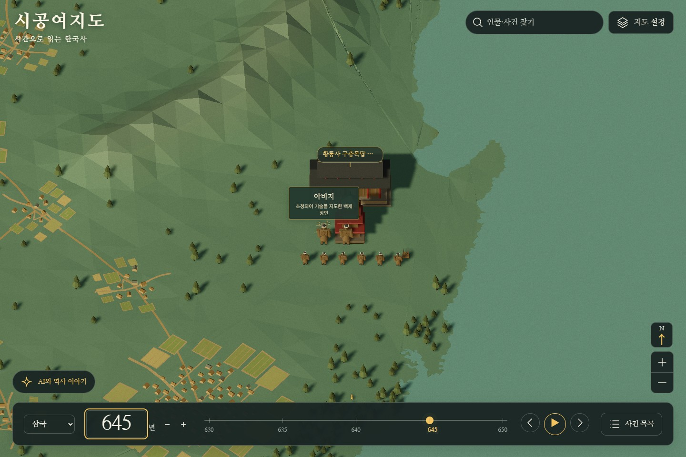
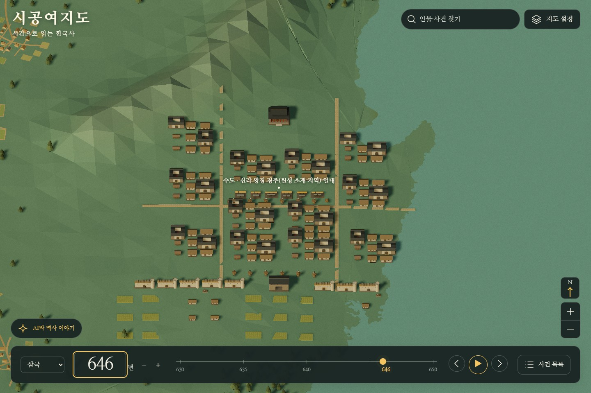
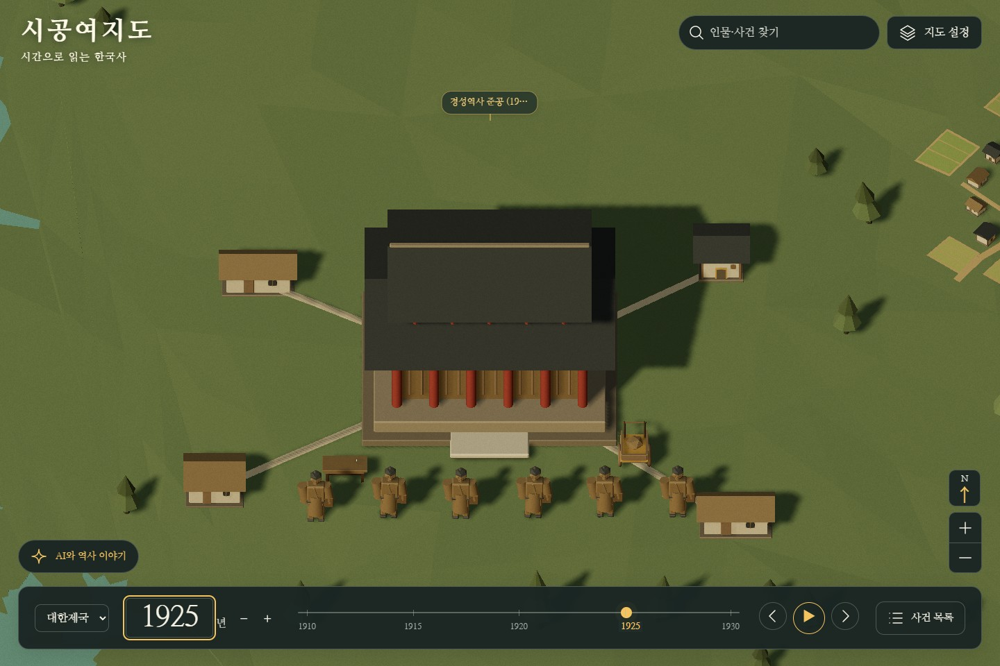
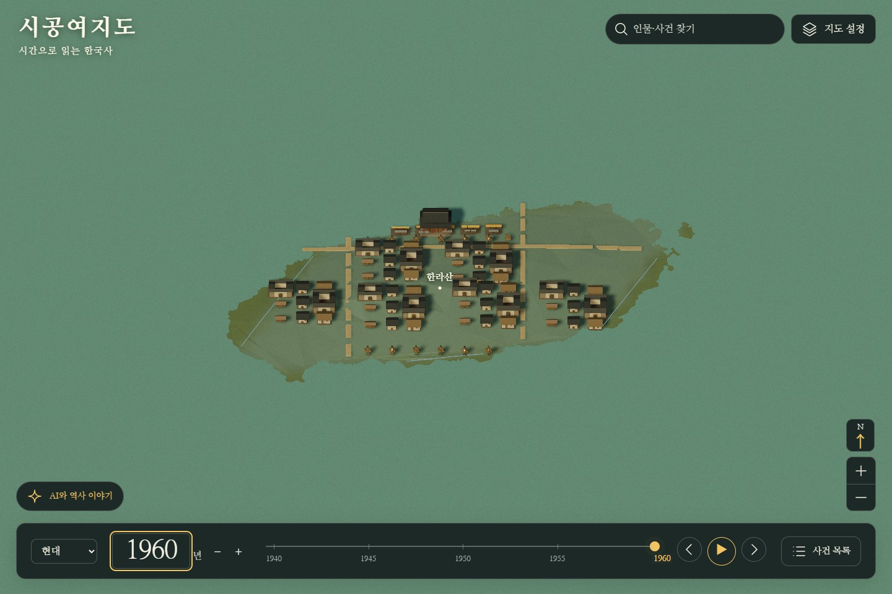
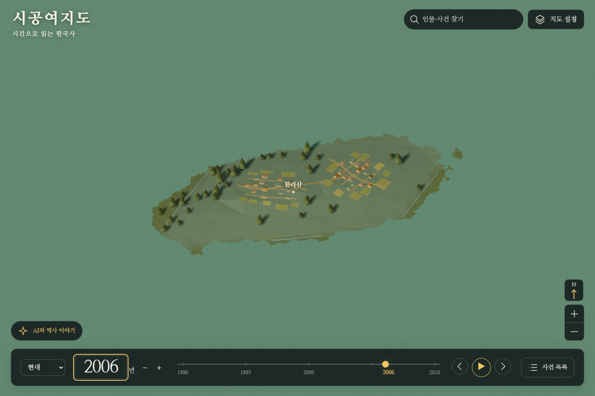
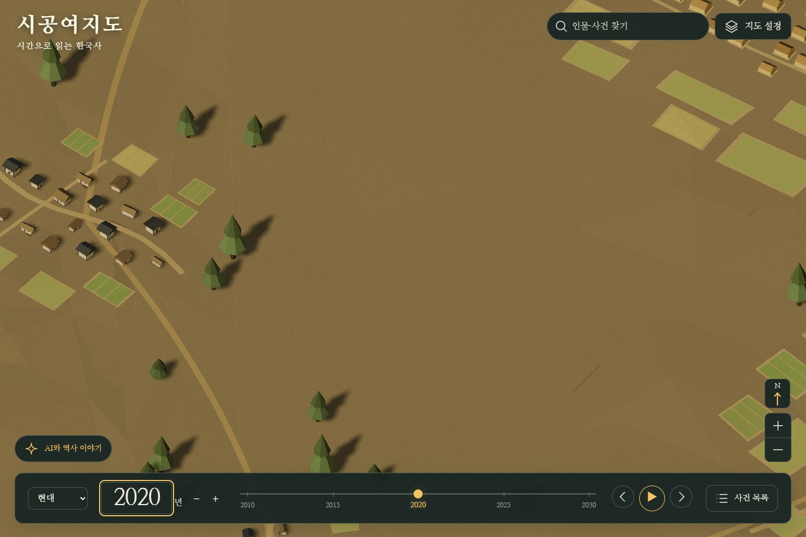

# 한반도 시대별 3D 세계 평가

이슈 [#169](https://github.com/Youkamii/sigong-yeojido/issues/169) · 기준 코드 `7312de21fd53dbf0a4bd3e40600461847f69a42f` · 공개 주소 [시공여지도](https://sigong.rabbion.info/)

**현재 화면은 시대별 역사·문화와 사람이 사는 세계를 충분히 전달하지 못한다.** 집을 늘리는 수정은 일부 빈 곳을 채웠지만, 사건과 생활권이 공존하지 못하고 수백 년의 변화가 같은 집·밭·전각 조합에 묻힌다. 도시·시설의 수명과 사건의 기간도 섞여 있다. 모델 수와 기능 검사 통과를 이 목표의 완료로 판단한 것이 잘못이었다.

이 보고서는 모델링 평가와 수정 기준이다. **이 평가 커밋은 서비스의 모델·데이터·지형을 수정하지 않는다.** 구현할 일은 아래 연결된 기능별 이슈에 남긴다. 이전 #161~166의 구현·검사 기록은 당시 기능 결과로 보존하되, 그것을 전 시대의 시각·역사 적합성 통과로 읽지 않는다.

## 검토 방식과 증거의 범위

2026년 9월 12일, 사용자의 요청대로 Astra max 평가자 12명을 시대 검토자 6명과 각각의 적대 검토자 6명으로 나누어 모두 완료했다. 동시에 가능한 하위 에이전트는 3명이므로 자리가 나는 순서대로 수행했다. 적대 검토자는 먼저 화면·코드·근거를 독립적으로 살핀 뒤 짝의 보고서를 읽고 동의·수정·기각·미검증을 판정했다. 적대 지적 수를 채우기 위해 오류를 만들어내지 않았다.

- 공개 서비스에서 **31개 연도, 114개 지역·거리 장면**을 촬영했다. 각 장면은 UI 포함 화면과 캔버스 원본 두 장이며, 화면을 새로 그린 목업이 아니다. 이번 캡처 과정의 브라우저 오류는 0건이다.
- 원경과 근경을 함께 보고, 경주 645→646년·부산 1592→1593년·제주 1960→2006→2020년처럼 같은 카메라로 연속성을 대조했다. 같은 시대의 여러 지역과 공통 모델 선택 코드도 살폈다.
- [캡처 메타데이터](captures/manifest.json)에 카메라·연도·지역·기간·렌더러 상태를 남겼다. [증거 목록](evidence-index.json)의 대표 화면 30장과 개별 보고서가 직접 연결한 화면을 저장소에 보관한다. 전체 228장과 원본 메타데이터는 로컬 `data/bulk/era-world-169-captures-20260912.zip`에 보관했다. 이 전체 압축본은 GitHub와 c2에 복사하지 않았다.
- 카메라 중심 좌표는 관찰 지점이다. 해당 역사 시설의 정확한 위치를 새로 확정한 좌표가 아니다. 캡처의 `detailArchetypes`는 누적 모델 캐시이며 현재 화면에 보이는 목록이 아니다.
- 모델 목록을 평지 대역에서 재현한 결과와 실제 지형 위 화면을 구분한다. 카탈로그에 모델이 있다는 것과 실제 장면에서 생성된다는 것도 다르다. 거리 160/60의 두 화면이 모든 도시 모델의 간략/상세 전환 경계를 넘었다는 보장도 없다. 모든 연도·지역·복식·건축 세부를 검증한 것은 아니다.
- 이번에는 기존 자료와 기관 원문으로 평가에 필요한 사실을 확인했다. 새 Claude 벌크 조사나 사료 수집을 완료했다고 세지 않는다. 순간 FPS 값도 새로운 성능 검사의 결과로 쓰지 않는다.

공통 [평가 기준](criteria.md) · [실제 제작 지침](implementation-brief.md) · [12인 작업 기록](task-state.json)

| 담당 시대 | 시대 검토 | 해당 시대의 적대 검토 |
|---|---|---|
| 선사·초기 국가 | [검토 01](reviews/01-prehistory-review.md) | [적대 01](reviews/01-prehistory-adversary.md) |
| 삼국·남북국 | [검토 02](reviews/02-three-kingdoms-review.md) | [적대 02](reviews/02-three-kingdoms-adversary.md) |
| 고려 | [검토 03](reviews/03-goryeo-review.md) | [적대 03](reviews/03-goryeo-adversary.md) |
| 조선 | [검토 04](reviews/04-joseon-review.md) | [적대 04](reviews/04-joseon-adversary.md) |
| 개항·일제강점기 | [검토 05](reviews/05-colonial-review.md) | [적대 05](reviews/05-colonial-adversary.md) |
| 해방·현대 | [검토 06](reviews/06-modern-review.md) | [적대 06](reviews/06-modern-adversary.md) |

개별 보고서의 `P0/P1`은 평가자가 정한 수정 우선순위이며, 보안 사고나 서비스 중단 등급이 아니다. 서로 다른 평가자의 등급과 지적 수를 그대로 합산하지 않는다. 보고서 안의 로컬 파일 경로는 평가 당시 원본 위치이며, 위 링크는 저장소에 보관한 원본 보고서다.

## 시대별 판정

| 시대 | 실제로 관찰한 상태 | 필요한 세계의 차이 | 핵심 증거 |
|---|---|---|---|
| 선사·초기 국가 | 같은 집이 확대하면 맞배집에서 원뿔집으로 바뀐다. 생활 배경은 주거·밭 위주이며 기원전 1500년, 서기 1년을 경계로 전국 설정이 바뀐다. | 입지·시기별 주거 평면, 취사·저장·식량 처리, 어로·채집·경작의 공존, 제작·교환·장례·행정과 생활의 연결 | [암사 원경](captures/-2000-amsa-160-ui.jpg), [암사 근경](captures/-2000-amsa-60-ui.jpg), [김해의 형태 혼재와 길/밭 충돌](captures/-100-gimhae-60-ui.jpg), [200년 평양](captures/200-pyongyang-60-ui.jpg) |
| 삼국·남북국 | 왕도들이 같은 도시 조합을 공유한다. 황룡사 건립 장면이 거대하게 등장한 645년에는 주변 도시가 작아지고, 646년에는 사찰이 사라지고 도시가 다시 커진다. | 왕도·지방·성곽·생산/교역과 사찰별 공간 구성, 건립 이후의 시설 사용, 신라·발해·후삼국이 겹치는 시기 | [645년 경주](captures/645-gyeongju-160-ui.jpg), [646년 경주](captures/646-gyeongju-160-ui.jpg), [800년 상경 관찰 지점](captures/800-sanggyong-160-ui.jpg), [830년 완도 관찰 지점](captures/830-wando-60-ui.jpg) |
| 고려 | 개경은 반복 주거 블록, 1240년 강화는 대장경 사건 위주로 보인다. 사찰·인쇄·생산 활동의 의미가 범용 전각/책상/인물로 소모된다. | 수도와 전시 수도의 일상, 북방 생활, 포구·운송·도자 생산, 종교·인쇄·직물·시장·돌봄의 서로 다른 장면 | [1100년 개경](captures/1100-gaegyeong-160-ui.jpg), [1240년 강화](captures/1240-ganghwa-160-ui.jpg), [1377년 청주](captures/1377-cheongju-60-ui.jpg) |
| 조선 | 수도·지방 도시가 같은 배치 문법을 공유한다. 전쟁/구휼/의례 사건 때문에 생활 배경이 사라지거나 도시 크기가 달라진다. | 전기·후기의 변화, 도성·읍치·장터·농어촌·생산/운송·수군·교육·의례·구휼, 제주 고유 입지와 생업 | [1450년 한성](captures/1450-hanseong-160-ui.jpg), [1450년 전주](captures/1450-jeonju-160-ui.jpg), [1592년 부산](captures/1592-busan-160-ui.jpg), [1593년 부산](captures/1593-busan-160-ui.jpg), [1795년 제주](captures/1795-jeju-160-ui.jpg) |
| 개항·일제강점기 | 1925년 경성역사 준공에 기와 전각과 정렬된 인물이 표시된다. 1876~1969년 모델 계열이 넓게 묶이고, 1925년 UI 시대 선택은 대한제국으로 표시된다. | 기존 도시와 역·철도·전차·항구·공업·상가·학교·병원·주거의 혼재, 노동과 계층·통제·저항·강제 동원의 관계 | [1880년 한성](captures/1880-hanseong-160-ui.jpg), [1900년 한성](captures/1900-hanseong-160-ui.jpg), [1925년 경성역 장면](captures/1925-hanseong-60-ui.jpg), [1935년 인천](captures/1935-incheon-160-ui.jpg) |
| 해방·전쟁·산업화·현대 | 제주 4·3은 양쪽 병사 격자로 나타난다. 제주시는 2006년에 제거된다. 1975년 포항·2020년 강남/평양 관찰 화면은 집·밭·흙길 위주이며 현대 북부 주거는 1700년 모형으로 대체한다. | 피난·복구·도시 성장, 구도심·저층/공동주택·상업·공업/항만·교통·공공 서비스의 관계, 지역별 농어촌과 북부·제주의 변화 | [1948년 제주](captures/1948-jeju-160-ui.jpg), [1975년 포항](captures/1975-pohang-60-ui.jpg), [2020년 강남](captures/2020-seoul_gangnam-160-ui.jpg), [2020년 평양](captures/2020-pyongyang-60-ui.jpg), [2006년 제주](captures/2006-jeju-160-ui.jpg) |

“다른 시기에는 사람이 살지 않았나”라는 지적은 맞다. 현재 자료의 원문·주장 수가 적다는 말과는 구분해야 한다. 많은 자료가 있어도 지속되는 도시·시설·생업 구역으로 연결되지 않으면, 화면에는 특정 사건의 몇 년만 남는다. 이름 없는 생활 배경을 허용한 사용자 요구도 집과 밭을 일괄 복제하는 데 그쳐서는 충족되지 않는다.

기존 #160의 객체 재사용은 같은 시각 입력을 가진 모델을 유지하는 기능이다. 그것만으로 장소의 실제 수명이나 시대별 구성이 올바르게 정의되지는 않는다. “그 기간 동안 한양을 유지하면 되지 않나”라는 요구를 충족하려면 재사용 기능과 함께 도시·시설·이름·수도 역할·사건을 따로 유지하는 자료와 장면 구성이 필요하다.

### 제주를 여러 시기로 이어서 보면

| 관찰 시점 | 확인한 문제와 한계 | 이어져야 할 변화 |
|---|---|---|
| 선사·초기 국가 | 기존 제주 감사와 이번 -1000년 캡처에서 일반 생활 배경을 관찰했다. 삼양동의 정확한 편년과 집 복원은 이 평가로 확정하지 않았다. | 입지와 시기별 주거·식량 처리·어로·교환·장례를 구별하고 본토 템플릿의 복사로 끝내지 않음 |
| 삼국·고려 | 이전 600·1100·1270·1273년 감사에서 평시 두 군집, 사건 때의 대형 성/군인과 생활 배경 제거를 확인했다. | 평시 탐라 생활과 정치·교류 변화, 항파두리의 실제 성격, 농어업·생산·목축의 시기 구분 |
| 조선 | 1795년 구휼 사건에서 곡식과 인물이 남고 주변 생활 배경이 억제된다. | 구휼을 받는 생활권과 운송·분배, 읍성·주거·농어업을 함께 유지 |
| 근대·1948년 | 1948년은 양쪽 군인 격자와 깃발이 섬을 차지한다. | 근대 생활의 연속 위에 사건의 민간 피해·피난·진압 관계를 자료에 맞게 표현 |
| 1960·1975년 | 섬 크기에 비해 큰 범용 도시가 표시된다. | 섬의 생활권 범위에 맞춘 도시·항구·농어촌의 연결과 단계별 변화 |
| 2006·2020년 | 2005년에 끝난 행정 기간 필터 때문에 도시가 제거되고 익명 군집 위주로 돌아간다. | 이름·행정 구조의 변화와 도시 자체의 지속을 분리하고 현대 도시·관광·교통·섬의 생업을 함께 표현 |

제주 문제의 추적 이슈는 [#168](https://github.com/Youkamii/sigong-yeojido/issues/168)이다. 제주의 몇 장면만 특수 처리하는 해결책으로 끝내면 다른 지역에서 같은 수명·크기·공존 문제가 반복된다.

이전 제주·#166 보조 화면은 이번 114개 장면과 구별한다. 개별 평가자가 이전 캡처의 코드 동일성을 확인하지 못한 비교는 현재 버전의 전환 검사로 승격하지 않았다. 특히 1795년에 어느 셀이 제거됐는지의 전후 런타임 추적은 별도 확인 사항이며, 현재 빈 생활 배경과 셀을 통째로 억제하는 코드 경로를 확인한 것과 구분한다.

## 여러 시대에서 반복된 원인

아래는 같은 원인을 여러 시대에서 발견한 것을 합친 목록이다. 에이전트별 지적 수를 모두 더해 고유 결함 수로 세지 않는다.

| 원인 | 현재 코드와 재현 | 수정의 핵심 |
|---|---|---|
| 시설·장소의 수명을 사건/이름 기간으로 처리 | 황룡사 건립 다음 해의 부재, 제주시 `1955~2005` 필터. 제주시 설명 자체는 2006년 행정 개편을 도시 소멸로 해석하지 말라고 적는다. | 시설 사용과 건립 사건, 장소와 이름/수도 역할의 기간을 분리 |
| 사건을 먼저 배치한 뒤 기존 도시를 축소 | `chronicle-assets.js:179–195`의 사건 우선·`nearest`·`compact`·`maxRadius`, `chronicle-event-scenes.js:58–63`의 전체 크기 조절 | 도시의 규모를 다른 사건의 존재 여부로 바꾸지 않고 활동을 해당 구역에 배치 |
| 큰 원형 점유 범위로 생활권 전체 제거 | `chronicle-scenery.js`의 생활권 가용 여부와 사건 점유 범위. 제주·강화·조선 사건 화면에서 주변 생활 상실 | 구역·시설·활동의 공간을 맞추고 주변 생활과 공존 |
| 전국 단일 시대 설정과 북부의 과거 대체 | `scenery-period.js`, `period-buildings.js`, `period-figures.js`. 현대화 분기 위도 `37.7`, 북부 주거에 대표 연도 `1700` 사용 | 실제 지역·용도·변화 단계로 외형을 선택하고 자료 부족을 과거 양식으로 대체하지 않음 |
| 자료의 행위와 모델 선택이 끊김 | 경성역사→기와 전각, 묘덕의 비구니→학자, 다양한 건설/제작/철거가 동일 기본 조합. 좁은 문자열 분기와 기본값 | 장면 유형·시설 기능·행위·참여 관계를 명시해 모델과 연결 |
| 사건의 성격을 병사 배열로 평탄화 | 제주 4·3 화면과 전투 위주 분기 | 전투·진압·민간 피해·피난·시위·구휼·재난을 자료에 맞는 관계와 행위로 구분 |
| 거리별 모형·길·밭의 공간 불일치 | 선사 원경은 맞배집, 근경은 원뿔집. 김해 동일 필지를 길이 관통하는 경로를 재현 | 같은 건물의 형태·방향을 유지하며 간략화, 길/필지/집을 함께 배치 |
| 물길과 생활 구역의 연결 부재 | `ChronicleWorld`가 부모의 강 그룹을 제거하고 현재 경로에 재생성이 없다. 공개 런타임 열거에서도 이름에 river가 있는 객체는 0개 | 기존 #144 범위에서 강 표시를 연결하고 #86의 길·나루·포구와 관계를 검토 |
| 이동 가능한 영역과 생활을 만드는 영역이 다름 | `settlement-regions.js:9–13`은 `world.bounds`와 `world.rings` 안에서만 배경을 만든다. 상경 관찰점은 그 바깥이지만 더 넓은 이동 영역에는 들어간다. | 북방의 확인된 도시와 익명 생활을 적절한 지면·기간에 연결. 빈 배경을 발해의 역사 자료 부재로 해석하지 않음 |

강에 관한 판정은 [실제 런타임 열거](runtime-inspection.json), 생성자 코드와 화면을 함께 근거로 삼는다. 이름 검색 결과만으로 모든 이름 없는 메시까지 없다고 증명한 것은 아니다. 이번 감사에서 강·해안선·지형을 다시 수정하지 않았다.

## 직접 비교할 화면

### 건립 사건이 끝나자 시설이 사라지고 도시가 커지는 경주

645년과 646년은 같은 카메라다. 사찰과 도시의 수명을 별도로 다루고 규모를 유지해야 한다.

### 역의 기능을 전각으로 잘못 전달하는 1925년

정렬된 인물과 기와 전각을 늘리는 것으로 철도·역·도시의 변화를 전달할 수 없다.

### 도시가 사라지는 제주, 과거 주거로 남은 현대 북부

제주의 1960년 도시는 섬에 비해 크며, 2006년에는 그 도시가 제거되어 생활 배경 두 군집만 남는다. 현대 북부의 자료가 부족하다는 이유로 조선 주거를 기본값으로 쓰는 것도 현대 생활의 표현이 아니다.

## 적대 검토와 총괄 판정

적대 검토는 같은 결론을 한 번 더 쓰는 절차가 아니다. 현재 구현에 대한 근거 있는 지적은 채택하고, 잘못된 수정과 증거 범위를 넘는 단정은 제외한다. 아래에서 ‘수정’은 프로그램을 이미 수정했다는 뜻이 아니라 평가 주장·권고의 범위를 고쳤다는 뜻이다.

| 쌍 | 함께 확인한 문제 | 반박에서 바뀐 판단과 총괄 결정 |
|---|---|---|
| 선사·초기 국가 | 거리별 주거형 불일치, 일괄 시대 설정, 생활 행위 연결 부족 | **채택:** 길/밭 충돌, 현재 강 표시 경로 단절, 낙랑의 행정 활동이 정렬 인물에 묻히는 문제. **제외:** 선사 전체를 둥근 집·높은 창고·고인돌 조합으로 교체하는 방식, 누적 캐시를 현재 보이는 조선 집으로 해석하는 방식. 지역당 동작 수·임의 성능 비율은 사용자 완료 조건이 아님. |
| 삼국·남북국 | 경주 시설/도시 연속성, 공통 시대 전환, 사찰의 기능과 형태 손실 | **채택:** 시설·사건·인물 기간 분리와 생활권 연결. 우산국 위협 항해→항구 운영, 청해진 이주→일반 모임, 해인사 착수→일반 주택 공사라는 추가 코드 선택 오류를 #173에 연결. **범위 수정:** 751년 불국사·800년 상경에 후대 완성형을 소급하지 않음. 거리 160/60으로 모든 도시 LOD를 검사했다고 할 수 없으며, 실제 전환 거리 안팎 검사가 필요. ‘구조 차이 3개’ 같은 할당량은 제외. |
| 고려 | 강도 생활이 사건에 밀림, 시설 기간 혼용, 묘덕의 역할과 후원/현장 관계 혼동 | **채택:** 판각 집단이 `Person` 필터에서 빠져 작업자가 생성되지 않는 추가 연결 결함. **제외:** 집단을 무조건 개인으로 바꾸고 정규식을 적용하는 수정—그렇게 하면 ‘대장도감’의 ‘대장’ 때문에 지휘관으로 분류되는 반례가 있음. **범위 수정:** 이전 제주 사진은 현재 SHA의 전환 증거로 쓰지 않음. 같은 부품 자체를 고증 오류로 판정하지 않고 기능·입지·시기의 차이를 검토. 특정 난파선의 선형/화물을 고려 모든 항구에 복사하지 않음. |
| 조선 | 한성 축소, 사건과 생활권 충돌, 행정 역할/시설 기간, 서원·개시·진찬의 의미 손실 | **채택:** 부산진 양측을 같은 조선 군인으로 만들고 군민 집단을 놓치는 문제, 신유박해를 학자 모임으로 선택하는 추가 결함. **범위 수정:** 구휼 전용 조합과 통제영·분원리 지속 설정은 이미 있으므로 ‘모두 일반 집회·단년 시설’이라는 요약은 제외. 1593년 부산을 평시로 즉시 복원하지 않고, 1592~1637 전체를 하나의 전쟁 상태로 묶지 않음. 양로 잔치는 상시 간병·부양 체계의 증거가 아님. |
| 개항·일제강점기 | 도시 축소·시설 수명, 경성역의 전각화, 시간선 시대 표시 오류 | **채택:** 우금치 농민군의 공격이 진영 필드 때문에 방어 동작으로 바뀌며 양측을 같은 창병으로 만드는 코드 결함. 소속과 전술 행동을 분리해야 함. **범위 수정:** 긴 모델 재사용 기간 자체를 오류로 삼지 않고 구도심·농촌의 지속과 새 기능의 혼재를 표현. 1926년 역의 실제 화면은 아직 미검증. 모든 역을 돔 건물로, 모든 항구를 같은 신식 항만으로 바꾸지 않음. |
| 해방·현대 | 제주시·현대 시설의 지속 실패, 북부 1700년 대체, 농촌형 생활권 반복, 민간 피해·재난 등의 의미 손실 | **채택:** 정전 조인이 청사·군중으로 떨어지는 사례를 기존 장면 선택 결함에 포함. 농촌 후보지에 아파트만 끼우는 방식으로 해안·경사 도시를 해결할 수 없음. **우선순위 수정:** 통근·등교·장보기·돌봄·노동의 관계는 건물 완성 뒤 선택적으로 넣을 장식이 아니라 도시 판정에 포함. **범위 수정:** 연도별 캡처와 같은 해 선택/해제 시험을 구분하고, 2020년을 2026년 직접 검증으로 부르지 않음. 제주4·3·5·18을 무조건 비무장 시민만으로 교체해 실제 무장 충돌 국면을 지우는 수정도 제외. |

총괄은 여섯 쌍의 핵심 미충족 판정을 유지한다. 공통 부품·긴 재사용 기간·단순한 3D 자체가 잘못은 아니다. 그 선택이 실제로 다른 장소·기능·참여 관계를 지우거나 시간의 연속성을 끊는지가 판단 기준이다. 얼굴·옷·소품의 정교함을 늘리기 전에 삶의 관계가 있어야 하며, 시설을 많이 세운 뒤 사람의 생활을 계속 후순위로 미루지 않는다.

고려 적대 보고서는 독립 화면·핵심 코드 관찰 뒤 자료 검색 중 짝 보고서 일부가 검색 결과에 들어온 사실도 기록했다. 모든 자료 열람이 완전히 차단된 평가였다고 표현하지 않는다. 개별 보고서의 실행·검색 제한은 그대로 보존한다.

## 필요한 수정과 남은 확인

구현 순서·생활 구역·시대별 첫 제작 묶음·같은 기간의 모델 재사용 기준은 [제작 지침](implementation-brief.md)에 정리했다. 작은 마을·읍치·수도·공업도시를 구분하고, 그곳의 집·사람·작업·길·물·시설이 함께 읽히게 만들어야 한다. 지도와 모든 에셋을 일괄 축소하거나 템플릿 종류만 늘리는 것으로 끝내지 않는다.

| 순서 | 기능별 이슈 | 이번 결과와 다음 완료 기준 |
|---|---|---|
| 1 | [#170 도시·시설의 지속](https://github.com/Youkamii/sigong-yeojido/issues/170) | 건립/사용, 이름/장소, 수도 역할/도시를 분리. 경주·경성역·제주의 전후 장면이 이어져야 함 |
| 1 | [#171 사건과 생활권의 공존·배치](https://github.com/Youkamii/sigong-yeojido/issues/171) | 사건 때문에 도시 크기를 바꾸거나 이웃 생활권을 제거하지 않음. 섬·물·산·길·필지 관계를 맞춤 |
| 2 | [#172 시대·지역·용도와 거리별 외형](https://github.com/Youkamii/sigong-yeojido/issues/172) | 현대 북부의 1700년 대체와 전국 일괄 전환을 수정. 확대 전후 같은 집의 형태 유지 |
| 2 | [#173 시설·행위·참여 관계](https://github.com/Youkamii/sigong-yeojido/issues/173) | 역·사찰·인쇄·철거·재난·구휼·민간 피해의 실제 의미를 조립기로 전달. 실명 인물의 현장 관계 구별 |
| 3 | [#174 전 시대의 생활 구역](https://github.com/Youkamii/sigong-yeojido/issues/174) | 각 시대·지역의 주거·생산·교역·교통·공공 생활을 서로 연결. 위 수명/공존/외형 수정 위에서 확장 |
| 별도 작은 수정 | [#175 시간선 시대 이름](https://github.com/Youkamii/sigong-yeojido/issues/175) | 1910~1944년의 시대 선택이 대한제국으로 남지 않도록 연도 입력·이동과 대조 |

위 6개 이슈는 **열린 구현 작업**이며 이번에 완료 처리하지 않는다. 제주 전체 추적 [#168](https://github.com/Youkamii/sigong-yeojido/issues/168), 강 [#144](https://github.com/Youkamii/sigong-yeojido/issues/144), 지형 [#145](https://github.com/Youkamii/sigong-yeojido/issues/145), 출처 있는 옛 길 [#86](https://github.com/Youkamii/sigong-yeojido/issues/86), 수집 공백 [#52](https://github.com/Youkamii/sigong-yeojido/issues/52)도 남는다. 특히 새 생활 배경을 만들었다고 사료 수집 완료로 세지 않는다.

현재 확인된 문제를 고치는 것과 별도로, 특정 유적의 정확한 위치·편년·복식·공법, 모든 지역의 전후 상태, 모든 연도의 장면, 실제 저사양/모바일 성능은 추가 확인이 필요하다. 이름 없는 생활 배경에는 개별 집의 역사 근거를 요구하지 않되, 특정 시설·인물·사건의 이름을 붙이는 경우에는 그 이름의 기능·장소·기간·참여 관계를 훼손하지 않는다.

이번 결과의 통과 대상은 평가 산출물이다. 서비스의 시대별 시각 적합성은 위 결함을 수정한 뒤 실제 화면으로 다시 판정해야 한다.

## 산출물 확인

[확인 결과](verification.json): 12개 보고서와 기록된 해시, 고유 에이전트 12개·적대 쌍 6개, 로컬 문서 링크 151개, JSON 16개, 저장소에 보관한 실제 화면 95장을 확인했다. 보고서는 내용 변경 없이 줄바꿈과 파일 끝 빈 줄만 정리했고, 원본·보관본 해시를 작업 기록에 나누어 남겼다. 변경 파일은 문서와 캡처 증거뿐이다.

앱 구현 검사·새 성능 측정은 `NOT_RUN`이다. GitHub Actions workflow는 0개로 CI가 설정되어 있지 않다. 이번 문서의 검사 통과를 #170~175 구현이나 사이트의 시각 적합성 통과로 바꾸어 보고하지 않는다.
