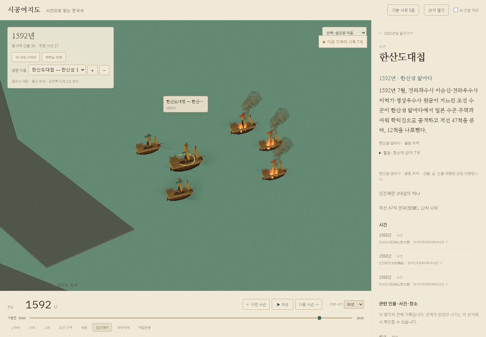
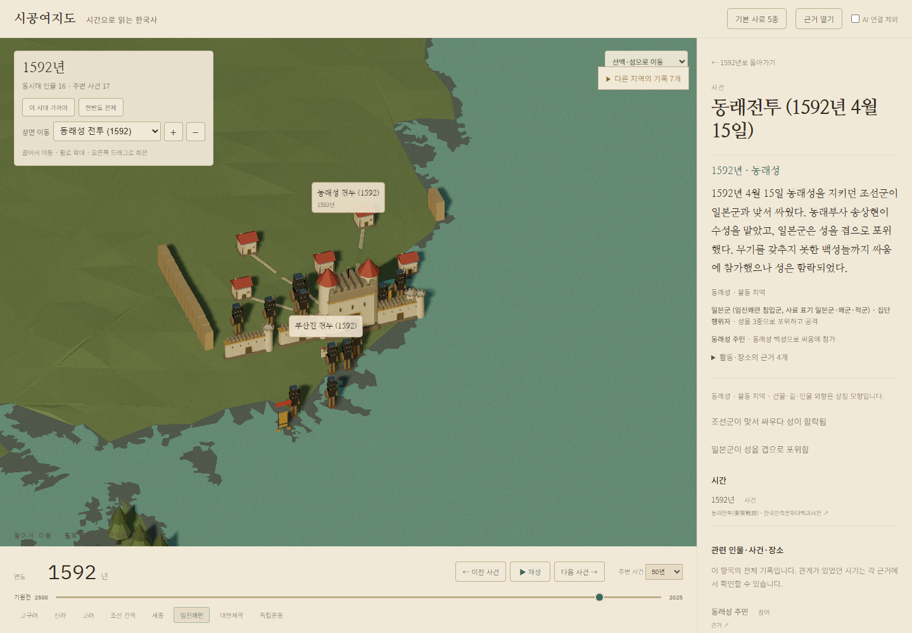
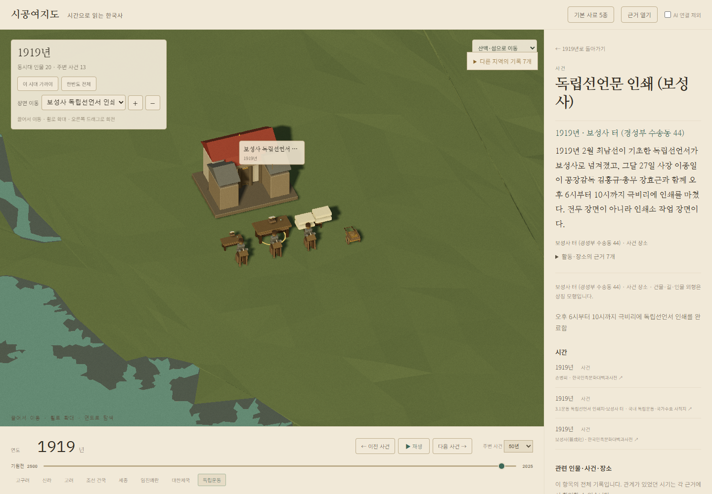
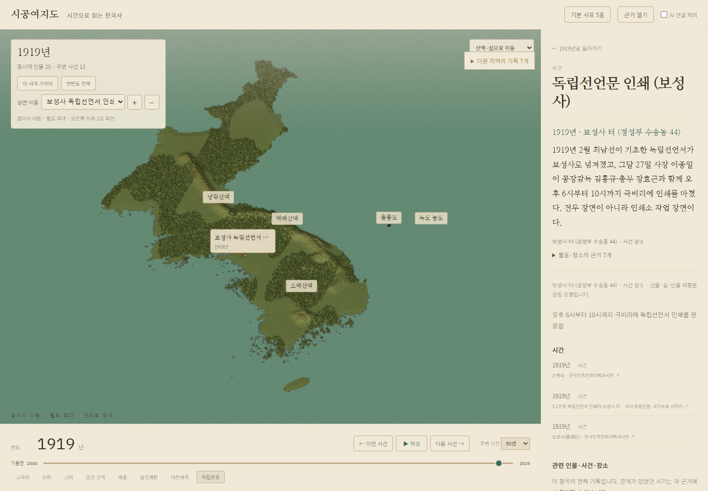

# 사건으로 읽는 3D 지도 — #99, #101

인물의 생존 기간과 전쟁 참여 관계만으로 지도에 모형을 놓던 방식을 바꿨다. 선택한 연도의 사건·활동·장소 근거를 묶고, 현장 참여가 확인된 인물만 그 장면에 배치한다. 장소가 연결되지 않은 기록은 시간 목록에서 계속 읽을 수 있다.

## 반영한 장면

- 부산진·동래·진주·행주: 성문과 이어진 성벽, 성 안의 방어 병력과 성 밖의 공격 병력.
- 1592년 경복궁 소실: 건물에 불과 연기를 붙인다. 방화 주체가 엇갈리는 자료를 한쪽의 행동으로 확정하지 않는다.
- 한산도·당항포·명량·노량: 바다에 두 함대를 나누어 놓고, 지휘관은 같은 편의 함선에 배치한다. 화재 기록이 있는 왜선에만 불을 붙인다. 명량의 불화살 기록을 함선 화재로 확대하지 않는다.
- 1593년 한산도 본영: 해당 연도 이순신의 본영 설치와 임용을 섬의 영역에 연결한다. 섬의 발표 좌표와 화면 표시 중심을 구분하며 본영 건물의 실측 위치라고 주장하지 않는다.
- 1597년 한산도 본영 소실, 1919년 보성사 인쇄: 당시 행동에 맞는 건물·작업자·탁자·종이·수레를 구성한다.

가까운 사건은 선택한 사건을 펼쳐 보여준다. 사건 제목을 먼저 표시하고, 인물 이름은 선택할 때 펼친다. 실제 Fantology 카탈로그의 선박·벽·탁자 등 10개 조립 모형을 추가했다. 외형과 간격, 병력·선박 모형의 수는 이해를 돕는 표현이며 당시 진형이나 건축물의 복원도가 아니다.

## 실제 조사와 수집

| 작업 | 모델과 설정 | 저장 결과 |
|---|---|---|
| invasion_events | claude-opus-5, max | 53 claims, 34 발췌, 6 장면 |
| yi_naval | claude-opus-5, max | 75 claims, 36 발췌, 7 장면 |
| naval_positions | claude-opus-5, max | 4 해역의 좌표 자료와 파생 과정 |

각 실행의 종료 코드·세션 ID·모델 기록은 `data/research/scenes-101/*/run.json`에 있다. 수집한 원문 SHA256과 다운로드 manifest를 검사했다. 새 역사 서술은 한국학중앙연구원 자료를 중심으로 하며, 유적 위치에는 한국관광공사·독립기념관 자료를 사용했다. 해역의 공식 좌표를 확보하지 못한 부분은 위키데이터·위키백과 지리 좌표와 공개 수심 자료로 만든 근사 표시 중심임을 화면의 위치 근거에 명시했다.

성마다 다른 주민 집단을 하나의 행위자 ID로 합치던 초안은 사건별 ID로 나누었다. 당항포에서 이순신의 원격 지휘, 어영담에게 내려진 명령은 현장 승선을 확정하는 근거로 사용하지 않는다. 원래 수집 결과는 보존하고 통합 변경은 별도 기록한다.

## 지도와 그림자

HGIS의 저장된 13개 도 경계를 합쳐 해안선을 만들었다. 선을 다듬는 과정에서 명량 수로가 막히지 않도록 간격을 줄였다. 울릉도·독도 동도·서도는 실제 좌표와 외곽선을 유지한다. 현재 좌표로 선을 그릴 수 있는 산줄기는 백두대간·태백·소백·낭림 4개다. 그림자는 화면에 보이는 지면과 지형 높이에 맞춰 빛의 투영 범위를 잡으며, 전체 지형도 그림자를 드리운다.

## 검사와 남은 범위

- Python 116 tests, 두 Chronicle JavaScript 검사, 전체 자료 validator: PASS.
- 로컬 실제 원문을 붙인 화면에서 1592·1593·1594·1597·1598·1919 장면, 모델 생성 누락 0, 실행 오류 0 확인. 이는 공개 서버 검사를 대신하지 않는다.
- 공개 서버의 최종 결과는 후속 `event-scenes-production-101.json`과 그림자·지리 검사 기록으로 남긴다.
- 13개 장면 중 고하도 진영 이전은 섬 좌표를 확보하지 못해 지도에 놓지 않았다. 목포 행정 중심을 고하도라고 표시하지 않는다.
- 전체 한국사의 모든 사건 장면이 채워진 상태는 아니다. 1593년 한산도 본영의 조선소·항구 표현, 다른 시대의 활동 장소 연결, 북부 산맥 4개의 이어진 좌표 확보가 남는다.
- GitHub Actions workflow가 없어 CI는 NOT_RUN이다.

재생성은 `scripts/import_period_research.py --collection scenes-101`, `scripts/refine_scene_evidence.py`, `scripts/build_history_scenes.py --research <수집 폴더>` 순서다. 해안선·장면 표시 영역 생성 스크립트에는 Shapely가 필요하며 뷰어 실행에는 필요하지 않다.

## 공개 화면

남은 활동 장소·장면 확장은 [#103](https://github.com/Youkamii/sigong-yeojido/issues/103), 북부 산맥 보강은 #97에서 추적한다.
