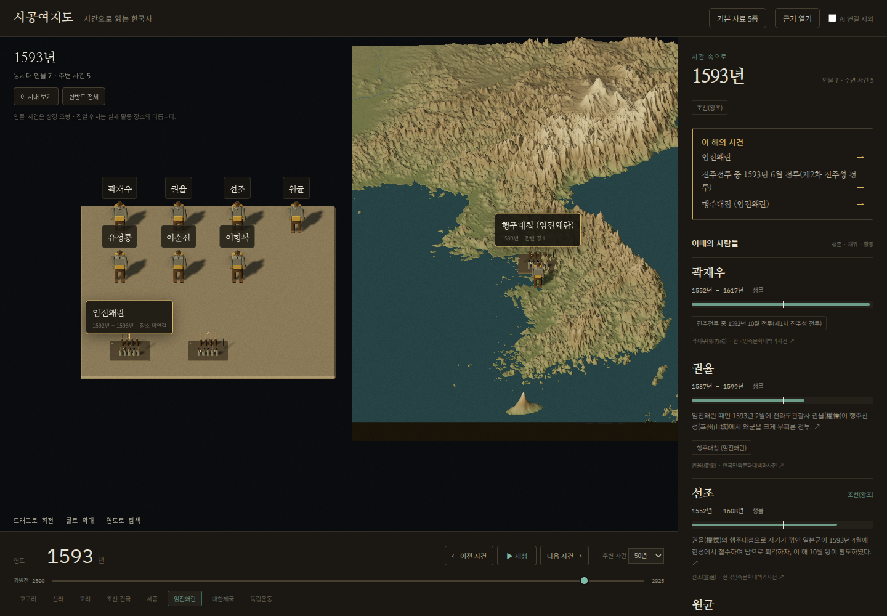

# Fantology 에셋 연결 — #93

이전 #91 화면은 인물 목록과 사건 이름을 시간에 연결했지만 실제 인물·사건 모델을 쓰지 않았다.
원본의 조형 선택·생성·배치·클릭 경로를 확인하고 이 연결을 추가한다.

## 원본에서 확인한 경로

원본은 `lia@192.168.35.144:/home/lia/fantology`다. 이 디렉터리는 Git 저장소가 아니다.
따라서 버전은 [파일별 SHA256](fantology-assets-93.json)으로 기록했다. 로컬 Fantology 사본과도 텍스트가 일치한다.

1. `main.js → figures.js`: Character의 지정 외형 또는 역할로 카탈로그 조형을 고른다.
2. `assetcatalog.js`: core·form·variant를 정규화한다. 원본 카탈로그에는 조형도 1,412개가 있다.
3. `assetforge.js → assetblueprint.js → landmarks.js`: 실제 부품 조형도를 조립하고 재질별로 병합한다.
   명시적으로 재질을 지정하지 않으면 부품마다 정한 나무·옷감·금속 등의 재질을 보존한다.
4. `world.anchorOf / surfaceAt`에서 위치와 높이를 얻고, 별도의 픽 메시를 인물 ID에 연결한다.
5. `main.js`가 만들어진 그룹을 엔진에 넣고 클릭 대상을 등록한다. 세계를 바꿀 때 이전 그룹을 해제한다.

원본 `figures.js`에는 인물 형상은 아직 시간 필터를 따르지 않는다는 주석과 `time: null`이 있다.
시공여지도에서는 검증된 `contextAt()` 결과로 모델과 클릭 대상을 함께 교체한다.
원본의 기간 미상 처리나 인명에 `왕`이 들어가면 서양 왕 조형을 고르는 규칙은 역사 사실의 근거로 사용하지 않는다.

원본 서비스는 실행 중이었다. 원본 `/assets`의 로그인 뒤 화면 검사는 **NOT_RUN**이다.
SSH로 읽은 원본 에셋과 생성기를 시공여지도에서 실제로 실행하고 화면·클릭을 검사한다.

## 연결한 것

- 생성 경로의 JavaScript 7개는 원문 그대로 가져왔다. Git의 LF 줄끝 정규화 전·후 해시를 구분해 기록한다.
  기존 엔진·재질·팔레트·지형 코드는 바꾸지 않았다.
- 카탈로그는 `human`, `scribe`, `monk`, `hanging_scroll`, `battle` 조형도 5개를 원본 그대로 골랐다.
  파일은 약 34 KB이며 3D 시작 뒤 한 번 불러온다. 조형 선택은 화면 표현이며 인물 초상·복식 복원을 뜻하지 않는다.
- `chronicle-asset-plan.js`가 생몰·재위·활동 근거에서 인물을, 해당 연도에 걸친 기록에서 사건을 고른다.
  근처 50년의 사건을 모두 현재 사건으로 그리지 않는다.
- 장소가 연결된 사건은 기관 좌표에 상징 장면을 놓고 관련 인물을 함께 표시한다.
  현재 장소 대표점과 인물의 정확한 활동 위치·병력 배치를 혼동하지 않는다.
- 위치 근거가 없는 기록은 지도 밖의 인물·사건 진열에 놓고 그 뜻을 화면에 적는다.
  같은 해를 살았다는 이유로 같은 도성에 모으거나 임의 좌표를 만들지 않는다.
- 모델과 이름을 클릭하면 해당 인물·사건, 생몰 기록, 관련 항목, 인용문과 실제 원문 발췌로 이어진다.
  사건 곁에서 누른 인물은 그 장면에서 확대된다.
- 시간·사료·AI 기록 제외 변경 때 이전 모델의 도형과 재질을 해제하고 클릭 대상도 교체한다.
  좁은 화면에서 이름이 겹치면 일부 이름만 표시하며 전체 인물 목록은 유지한다.

## 검사

`node scripts/test_chronicle_assets.mjs`는 실제 조형도 존재, 부품 재질 보존, 날짜·사망 이후 제외,
관계 근거, 미상 위치, 빈 사료 선택과 원본 조형 선택 규칙을 검사한다.

`scripts/verify_chronicle_assets.py`는 실제 c2 자료로 원본 모델을 렌더링하고 **캔버스 위 모델을 마우스로 클릭**한다.
카탈로그가 늦게 도착하는 동안 연도를 바꾸는 경우, 1392·1593·1919년, 실제 인용문,
사료·작성자 필터, 이전 도형 해제, 재생, 모바일을 검사한다.
화면 캡처 때만 렌더 루프를 잠깐 멈추며 그림이나 가짜 데이터로 대체하지 않는다.

개발 검사에서는 로컬 정적 파일과 읽기 전용 c2 API 프록시를 쓴다. 운영 검사는 공개 주소에서 별도로 한다.
외형 고증과 한국사 전체의 인물·사건·장소 수록 완료를 뜻하지 않는다.

## 운영 확인

기능 커밋은 `2209a2ad`다. [개발 검사 22개](fantology-assets-local-93.json)와
[공개 주소 검사 22개](fantology-assets-production-93.json)가 모두 통과했다.
1392년 8개·1593년 11개·1919년 10개 조형이 생성됐고, 날짜와 사료 선택에 따라 이전 모델의 도형 18개를 해제하는 것도 확인했다.
[기본 화질](fantology-assets-default-93.json)은 medium, 조형 11개, JavaScript·WebGL 오류 0이다.

[운영 반영 기록](fantology-assets-deployed-93.json): 정적 파일 13개의 실제 HTTP 응답을 Git 파일과 대조했다.
viewer 290920·watcher 290919·FinBridge 222676은 그대로 유지했다. GitHub Actions 워크플로는 0개이므로 CI는 NOT_RUN이다.

[모바일 화면](fantology-assets-mobile-93.png)도 확인했다. 원본 생성기·조형도 연결을 완료한 것이며 인물 초상·시대별 복식 복원을 완료한 것은 아니다.
