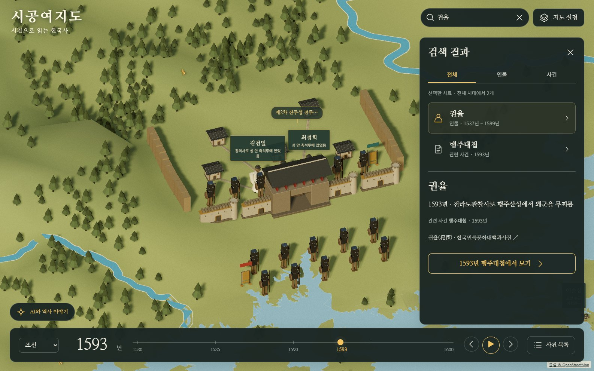
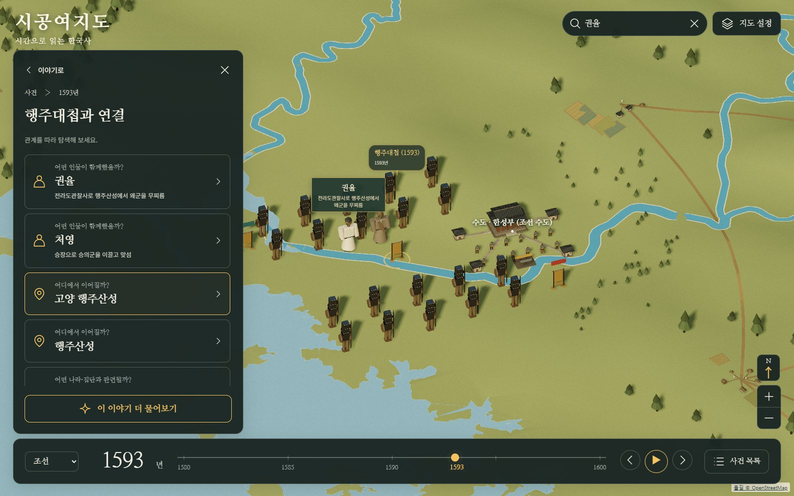
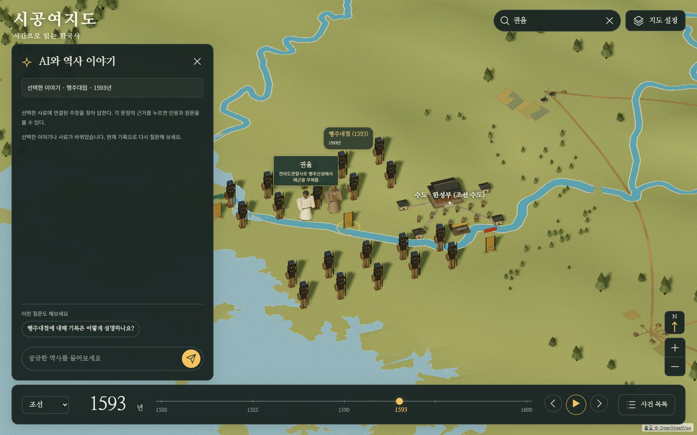
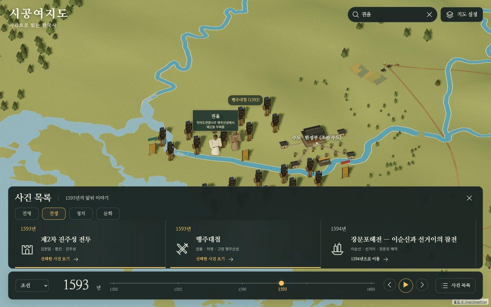
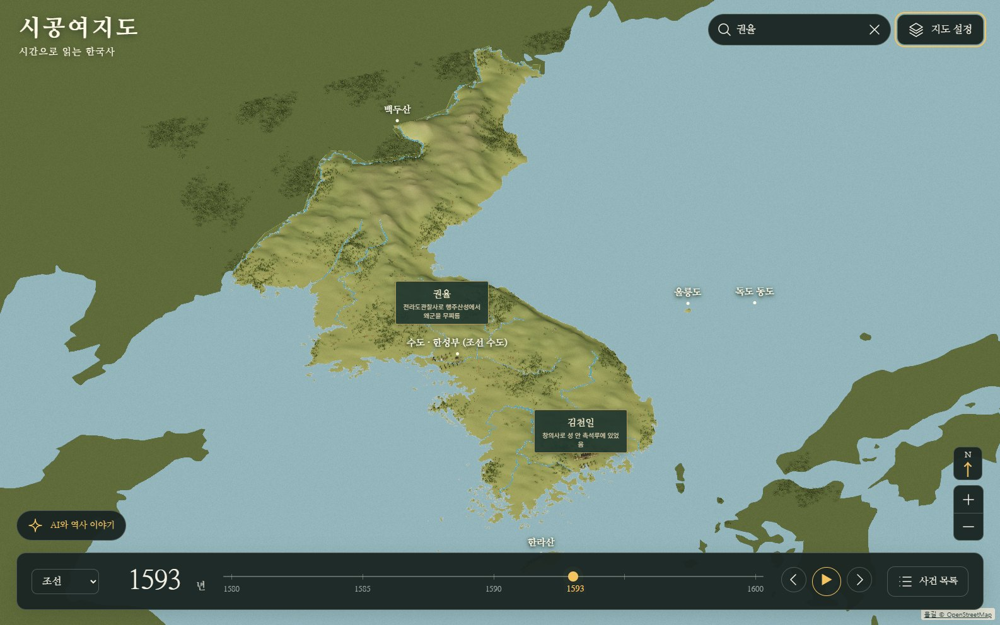

# 참고 화면 기반 지도 UI (#150–154)

[공개 미리보기](https://sigong.rabbion.info/previews/reference-ui/index.html)

사용자가 제공한 4개 화면을 따라 전체 화면 지도 위에 검색, 이야기와 관계, AI 대화, 하단 사건 목록을 배치했다. 짙은 녹회색 패널, 금색 강조, 명조 제목을 사용한다. 기본 지도는 현장을 가까이 보여주며, 이동·확대와 한반도 전체 보기를 유지한다.

## 반영 범위와 커밋

| 기능 | 이슈 | 구현 커밋 | 화면 검사 후 수정 |
|---|---|---|---|
| 전체 지도, 지도 설정, 연도 입력·재생, 좁은 화면 조작 | [#150](https://github.com/Youkamii/sigong-yeojido/issues/150) | `e1d48a06` | `d4f47bb8`: 연도 눈금 겹침과 터치 버튼 크기 |
| 인물·사건 검색, 관련 사건의 시대와 장소로 이동 | [#151](https://github.com/Youkamii/sigong-yeojido/issues/151) | `04d2d18c` | `ac7662df`: 장면 제목과 좁은 화면 검색 |
| 왼쪽 상세, 관계 따라 보기, 이전 이야기, 원문 근거 | [#152](https://github.com/Youkamii/sigong-yeojido/issues/152) | `bc34aa84` | `aae709c2`: 같은 연도의 사건을 열 때 장소가 잠시 비는 문제 |
| 지도를 유지하는 AI 대화, 선택 맥락과 인용 연결 | [#153](https://github.com/Youkamii/sigong-yeojido/issues/153) | `36208d77` | 기존 EvidenceChat와 `/api/chat` 사용 |
| 연도에 맞춰 움직이는 사건 목록, 전체·전쟁·정치·문화 선택 | [#154](https://github.com/Youkamii/sigong-yeojido/issues/154) | `56dcd2ef` | `5a8d0aed`: 연도 확정 후 카드 정렬 |

검색은 선택한 사료의 실제 인물·사건을 사용한다. 관계는 기존 Claim과 장면에 연결된 참여 인물·장소에서 가져온다. 사건 분류는 기존 장면 종류와 제목을 이용한 화면용 분류다. 새 역사 사실·관계·좌표를 추가한 작업이 아니다. 연도나 사료가 바뀌면 이전 선택과 대화 답변을 정리한다.

이벤트 카드는 화면 주변만 만들고 기존 가로 이동을 재사용한다. 매 프레임 지형 계산, 새 3D 모델, 배경 흐림 효과를 추가하지 않았다. 강·지형 개선은 선행 [PR #146](https://github.com/Youkamii/sigong-yeojido/pull/146)에 포함된 내용이다.

## 확인 결과

2026-09-11, 실행 코드 `d4f47bb8`의 공개 미리보기에서 [브라우저 검사 33개](reference-ui-150/checks.json)가 모두 통과했다. 브라우저 오류는 0개다. 실제 운영 역사 API와 연결했으며, 다음 흐름을 포함한다.

- 연도 직접 입력·기원전·재생·사료 전체 해제·강 표시 전환.
- 권율 검색 → 행주대첩 → 실제 장면 확대 → 관계의 권율 → 이전 이야기 → 원문 근거.
- 선택 사건을 담은 대화 요청, 지도 유지, 인용 클릭, 연도 변경 시 답변 정리.
- 사건 분류·1592/1593년 동기화·사건 카드에서 장면 이동·카드 렌더링 범위 제한.
- 전체 지도와 울릉도·독도 표식, 390px 화면의 검색·상세·연도·사건 목록 배치.

`test_chronicle.mjs`, `test_event_timeline.mjs`, `test_visual_geography.mjs`, `test_chronicle_assets.mjs`와 `git diff --check`도 통과했다.

대화 전송 검사는 브라우저에서만 모의 응답을 사용했다. 제품은 기존 실제 API를 호출한다. 실제 모델 응답과 물리적인 휴대폰·태블릿 검사는 **NOT_RUN**이다. 좁은 화면 검사는 데스크톱 Chrome의 터치·화면 크기 모사다. GitHub Actions workflow가 0개여서 CI는 **NOT_RUN**이다.

성능은 headless Chrome, 1586×992, DPR 1, medium에서 각각 약 1.4초씩 측정했다. 공개판 표본은 현장 약 163fps·프레임 간격 p95 6.2ms, 전체 보기 약 159fps·p95 6.3ms였다. 앞선 로컬 프런트 검사에서는 각각 149fps·12.2ms, 113fps·18.1ms였다. 준비 시간은 공개판 약 13초였다. 짧은 데스크톱 표본의 차이를 포함한 결과이며, 저사양 기기나 지속 사용 성능을 보장하는 수치로 쓰지 않는다. 상세 그리기 횟수와 삼각형 수는 측정 JSON에 보관했다.

재현 스크립트는 [verify_atlas_ui.py](../../scripts/verify_atlas_ui.py)다. Python용 Playwright와 Chrome이 필요하다.

```powershell
python scripts/verify_atlas_ui.py --url https://sigong.rabbion.info/previews/reference-ui/index.html --out "$env:TEMP/sigong-ui-check"
```

## 화면











[사건 상세](reference-ui-150/story.jpg) · [좁은 화면 지도](reference-ui-150/mobile-map.jpg) · [검색](reference-ui-150/mobile-search.jpg) · [상세](reference-ui-150/mobile-story.jpg) · [사건 목록](reference-ui-150/mobile-events.jpg)

## 병렬 작업과 반영 상태

- 작업 폴더: `C:/Users/gkfkd/Git/sigong-ui`, 브랜치: `codex/reference-map-ui`.
- 강·지형 브랜치 `codex/visual-rivers-peninsula`의 `998f6d9b`에서 분리했다. UI PR은 이 브랜치를 대상으로 하며, #146을 먼저 병합한 다음 UI PR의 대상을 main으로 옮긴다.
- 공개 미리보기는 c2의 `services/host/previews/reference-ui/`에 둔 정적 파일이다. `build-info.json`의 실행 코드 표시는 `d4f47bb8`이다. 이후 검사·문서 커밋은 실행 코드에 영향을 주지 않는다.
- 기본 주소의 main `4ceea311`과 Claude 작업 폴더는 변경하지 않았다. 서비스 재시작도 하지 않았다. 이번 UI는 미리보기까지 반영되었고 main 병합은 대기 중이다.
