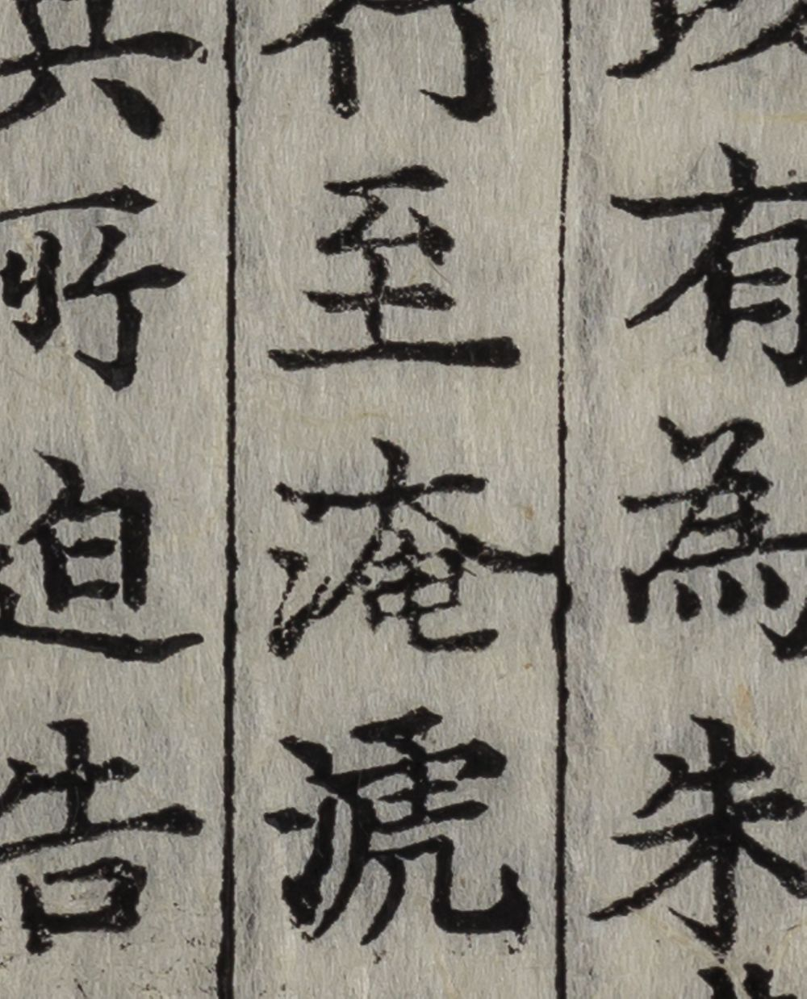
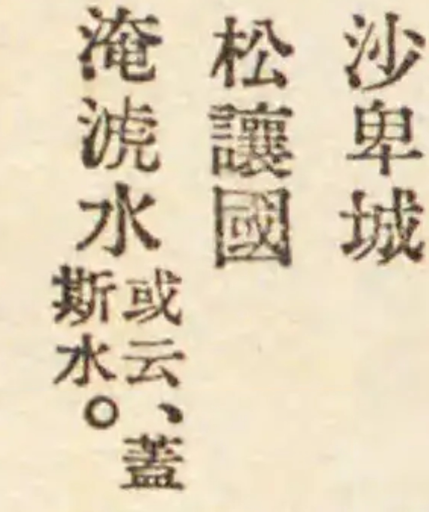

# 삼국사기 淲/㴲 판본 이미지 대조 (#8)

2026-09-07. 벌크 본문에 `淲`가 들어간 두 chunk를 기관이 공개한 판본 이미지와 대조했다. 권13은 두 판본, 권37은 한 판본에서 물 수변과 虎 모양의 오른쪽을 확인했다. 벌크의 淲와 맞는 자형이다. 원 벌크 텍스트는 바꾸지 않았다.

| 벌크 위치 | 실제 열어 본 판본·이미지 | 관찰 |
|---|---|---|
| `sg_013_0020_0010`, 권13 동명성왕조 | 교토대 부속도서관 소장 1574년 조선 간본, `rb00013306` 冊3 통면211 | `行至淹淲水`의 淹 다음 글자가 氵+虎 자형 |
| 같은 대목 | 일본 국회도서관, 조선사학회 1928년판, `1920811/R0000075`, 권13 2면 | 같은 자리에 氵+虎 자형 |
| `sg_037_0030_0120`, 권37 지리4의 지명 목록 | 같은 1928년판, `1920811/R0000192`, 권37 7면 | 왼쪽 면 마지막 열 하단 `淹淲水`, 작은 글씨의 蓋斯水 병기 |

소장: **京都大学附属図書館 / Kyoto University Library**. [서지와 이용조건](https://rmda.kulib.kyoto-u.ac.jp/item/rb00013306). 소장처 표시 조건으로 이미지 재이용을 허용한다. 이미지 일부를 IIIF 영역 요청으로 받아 위에 표시했다.

소장: **日本国立国会図書館 / National Diet Library, Japan**. [서지·PDM 표시가 있는 IIIF manifest](https://dl.ndl.go.jp/api/iiif/1920811/manifest.json). [권13 이미지](samguksagi-glyphs-8/ndl.jpg)도 함께 보존했다. 원 이미지 URL·SHA256·크기·영역은 [이미지 기록](samguksagi-glyphs-8/images.json)에 있다.

조사는 Claude Opus 5 / Max가 맡았고 [실행 기록](../../data/research/samguksagi-glyphs-8/run.json)을 보존했다. Codex가 두 권13 이미지를 내려받아 직접 열어 대조했다. Opus가 남긴 권37의 R0000193 후보는 해당 어구가 바로 앞 면에 이어지는 지점이었다. 원 chunk의 지명 순서와 인접 R0000192를 대조해 정확한 행을 찾아 확대했다.

이는 인쇄 글자의 육안 대조다. 이미지에 유니코드 코드포인트가 저장돼 있다는 뜻이 아니며, 두 기관 판본이 국편의 저본과 같다고 확정하지 않는다. 국편 웹이 실제로 `㴲`를 표시하는지는 robots 제한으로 **NOT_RUN**이다. #8의 국편 웹 퍼머링크 3건 대조 완료로 세지 않는다.

NDL robots의 `/api/iiif/` 허용과 교토대의 IIIF 경로 허용을 확인했다. 차단된 국편 도메인이나 우회 서비스에는 요청하지 않았다. 공개 기관 판본 세 지점의 실제 관찰과 국편 웹 미검증을 구별한다.
