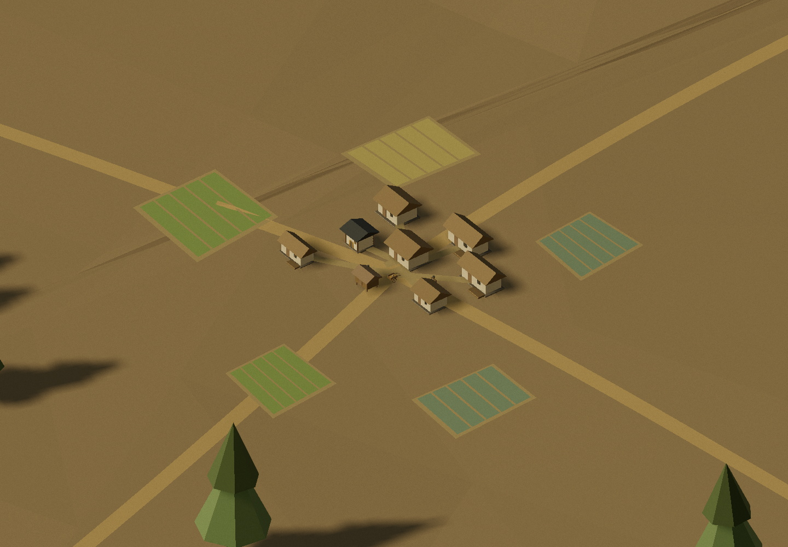

# 이름 없는 시대별 마을 (#162)

마을은 실제 취락의 위치·평면을 복원한 것이 아니라 이름 없는 생활 배경이다. 기존 카탈로그의 집·창고·회관·문·시장 부품을 재사용하고, 큰 지붕 윤곽과 높이·폭·마루를 달리한 108개 조형을 만들었다. 시대 경계, 지붕 비율, 집 수, 여섯 가지 배치는 미술 설정이며 전국의 주거가 그해에 바뀌었다는 뜻이 아니다.

## 자료와 미술 설정

이번 조형의 직접 입력은 저장소의 `history-asset-catalog.json`이다. 초기 집에는 기존 `rural_hut`, 초가에는 `rural_cottage`, 기와집에는 `korean_house`, 창고에는 `rural_store`의 부품을 썼다. 이 부품을 시대별로 나누는 비율과 변형은 자료에서 측정한 값이 아니다. 지도 지형·강·역사 Claim과 실제 마을 좌표는 변경하지 않았다.

별도 Claude Opus 5 / Max 세션에서 기관 자료를 검색하고 WebFetch 요약을 수집했다. 수집을 끝내고 같은 세션에서 정리 단계로 전환했지만, 이 커밋 시점의 최종 `village-research.json`은 미완성이다. 따라서 자료와 조형의 최종 대조는 아직 끝나지 않았다. 수집된 WebFetch 요약을 원본 HTML로 기록하거나, 시대별 지붕 비율·마을 평면의 확정 근거로 쓰지 않았다. Node·브라우저 검사는 이 연구 완료 여부와 별도로 실행한 결과다.

## 검사

[검사 기록](villages-162-validation.json)에 Node 검사 세 개와 실제 Chrome 결과를 함께 보관했다. Node에서는 실제 Three 조형을 만들되 지면과 캔버스 그림만 대역으로 사용했다. 평지 검사에서 88개 군집·집 519채·밭 319개를 생성했고, 먼 마을은 군집당 한 번의 그리기로 합쳤다. 마을이 역사 장면의 자리를 가리면 숨겨지고, 점유가 사라지면 다시 나타난다.

브라우저는 로컬 정적 파일과 공개 서비스의 실제 역사 API를 연결했다. 같은 북쪽 마을을 고정한 1600→1601 전환에서 상세·원경 조형의 UUID와 생성 횟수가 같았다. 고려·삼국·초기 시대로 바꾸면 건축과 생활 인물의 시대가 함께 바뀌었다. 복식 경계인 1895·1945도 캐시 구간에 반영했으며, 빠른 연도 변경은 마지막 연도의 조형으로 끝나는 것을 Node에서 확인했다.

북쪽 현대 배경은 남쪽 지붕개량 비율을 적용하지 않는 중립적인 집 변형이다. 이 선택 때문에 선사 움막이 되살아나던 경우를 없앴다. 아래는 수정 뒤 같은 북쪽 군집을 2000년으로 본 실제 합성 프레임이다. 카메라 코드를 고치지 않고 그리기 직후 캔버스를 읽어 저장했다.

