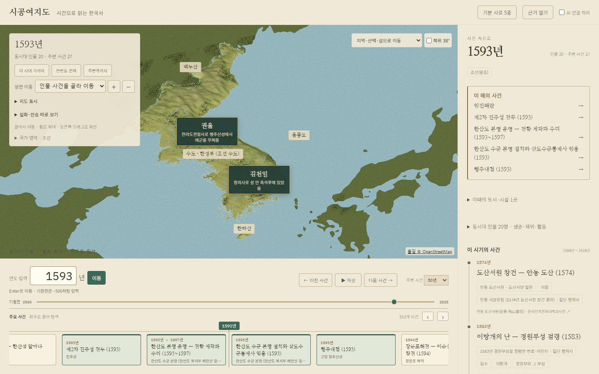
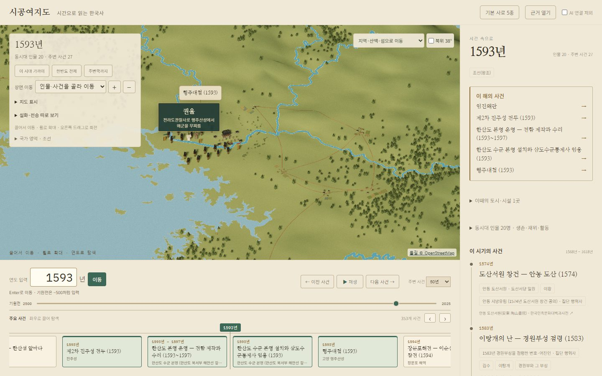

# 한반도 표현과 성능 (#145)

해안에서 길게 뻗던 삼각형 대신, 기존 해안선에 맞춰 자른 일정한 격자를 미리 만든다. 지면 삼각형은 74,182개에서 27,309개로 감소했다. 원래 육지 면적의 일치 비율은 0.9999999999999974다. `peninsula-surface`와 지면 높이 조회 방식은 기존 장면에서 그대로 사용한다.

이미 저장된 NOAA ETOPO 고도 자료가 산지의 모양을 결정하도록 바꾸고, 넓은 고도 평균과 과한 능선 솟음을 줄였다. 이어진 정점의 부드러운 법선, 고도별 색, 밝은 바다와 얇은 해안선으로 평야·산지·바다를 구별한다. 해수면 아래 암반 면은 만들지 않는다. 전체 탐색 범위, 울릉도·독도와 주변국의 좌표는 유지한다.

```text
python scripts/build_terrain_grid.py
node scripts/test_visual_geography.mjs
```

빌더는 Shapely의 constrained Delaunay 기능을 사용한다. 클라이언트는 미리 만든 면을 읽으며, 별도 지형 라이브러리를 설치하거나 실시간 삼각 분할을 하지 않는다. 좌표는 Float32, 정점 번호는 Uint16으로 저장한다. 해안이나 섬의 윤곽을 바꾸면 격자를 재생성해야 한다.

## 실제 검사 범위

공개 서비스의 실제 역사 데이터와 로컬 브랜치의 프런트 파일을 연결해 headless Chrome에서 검사했다. 1440×900, medium, DPR 1, RTX3060 환경이다. 비교 기준은 main `8440aa57`이다. [측정 원본](visual-map-145.json)에 준비 시간, 두 시점의 프레임 간격, 그리기 횟수·삼각형 수와 오류를 기록했다. 짧은 데스크톱 표본이며 저사양 기기의 FPS를 보장하는 수치로 쓰지 않는다.

강 표시 전환·강으로 이동·전면 방향·브라우저 오류·강 안의 나무 배치를 확인했다. 좌표와 원본 해시, 육지 면적, 정점 범위와 위쪽을 향하는 면은 `test_visual_geography.mjs`로 확인했다. 기존 장면·시대별 풍경·해안 조회 검사도 통과했다. GitHub workflow가 없어 CI는 NOT_RUN이다.

## 변경 후 화면





## 병렬 작업 범위

워크트리: `C:/Users/gkfkd/Git/sigong-visual` / 브랜치: `codex/visual-rivers-peninsula`.
Codex는 강·지면·바다·해안과 익명 풍경의 물길 회피만 변경했다. 기본 작업 폴더의 main과 Claude의 역사·기능 작업은 변경하지 않았다. 이 문서는 브랜치 검사 기록이며 운영 배포 완료를 뜻하지 않는다.
